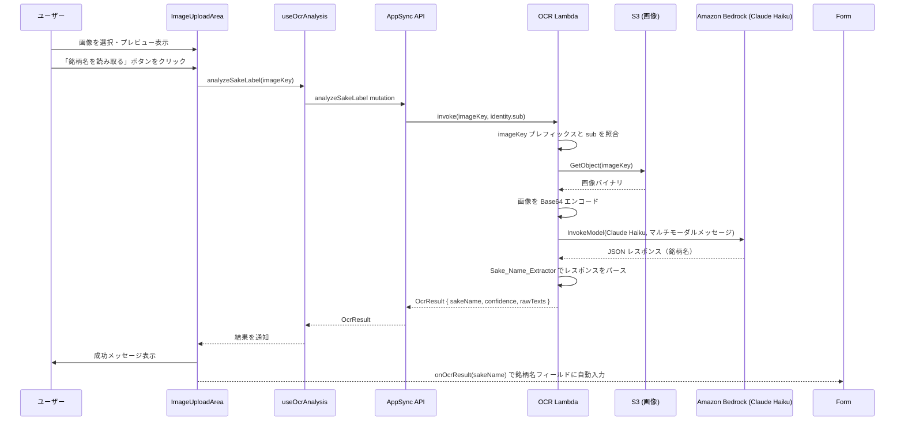
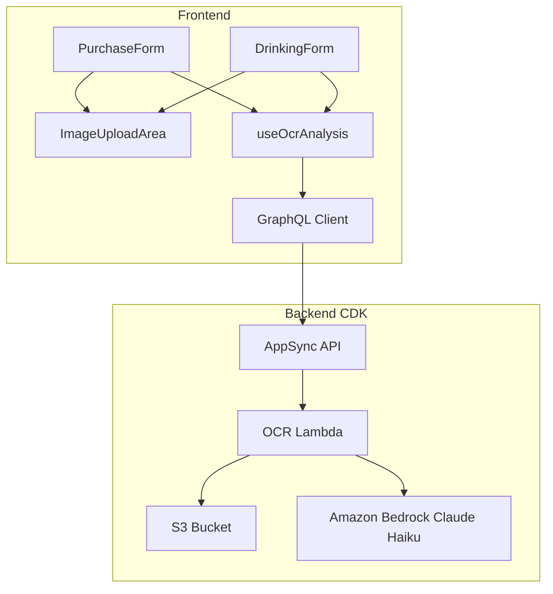

# 設計ドキュメント: 画像からの銘柄名自動取得（AI OCR）

## 概要

本機能は、購入登録・飲酒登録時に添付されたお酒のラベル画像から Amazon Bedrock の Claude Haiku（anthropic.claude-haiku-3-5系）を使用したマルチモーダル解析でテキストを抽出し、銘柄名を自動的にフォームへ入力する機能である。

ユーザーが画像をアップロードした後、「銘柄名を読み取る」ボタンをクリックすると、バックエンドの Lambda 関数が S3 から画像を取得し、Bedrock Claude Haiku にマルチモーダルメッセージとして送信する。Claude が銘柄名を JSON 形式で返し、フロントエンドのフォームに自動入力する。

### 設計判断

1. **Bedrock Claude Haiku を採用**: 当初は Amazon Rekognition DetectText を使用していたが、精度が不十分なため、マルチモーダル LLM による解析に切り替える。Claude Haiku は日本語ラベルの理解に優れ、銘柄名・製造者名・容量表記などの文脈的な区別が可能
2. **モデル ID**: `anthropic.claude-haiku-4-5-20251001-v1:0`（2025年10月リリースの Claude Haiku 4.5）を使用
3. **ユーザー明示トリガー方式**: 画像選択時の自動実行ではなく、ボタンクリックによる明示的なトリガーを採用。不要な API 呼び出しを防ぎ、ユーザーが画像確認後に実行できる
4. **既存 Lambda パターンの踏襲**: presigned-url Lambda と同じ NodejsFunction パターン（ESM、createRequire バナー）を使用し、一貫性を保つ
5. **Confidence の扱い**: Bedrock はスコアを返さないため、銘柄名が抽出できた場合は固定値 0.9、できなかった場合は 0.0 とする
6. **rawTexts の扱い**: Bedrock のレスポンステキスト全体を rawTexts に含める

## アーキテクチャ



### コンポーネント構成



## コンポーネントとインターフェース

### 1. GraphQL スキーマ追加

```graphql
# OCR 解析結果型
type OcrResult {
  sakeName: String
  confidence: Float!
  rawTexts: [String!]!
}

# Mutation に追加
type Mutation {
  # ... 既存のミューテーション
  analyzeSakeLabel(imageKey: String!): OcrResult!
}
```

### 2. OCR Lambda 関数 (`infra/lambda/ocr-analyzer/index.ts`)

既存の presigned-url Lambda と同じパターンで実装する。

```typescript
interface AppSyncEvent {
  info: { fieldName: string };
  arguments: { imageKey: string };
  identity: { sub: string };
}

interface OcrResult {
  sakeName: string | null;
  confidence: number;
  rawTexts: string[];
}

export async function handler(event: AppSyncEvent): Promise<OcrResult>
```

**処理フロー:**
1. `identity.sub` と `imageKey` プレフィックスの照合（アクセス制御）
2. S3 から画像を取得（`GetObjectCommand`）
3. 画像バイナリを Base64 エンコード
4. Bedrock `InvokeModelCommand` でマルチモーダルメッセージを送信
5. `extractSakeName()` でレスポンスをパースし銘柄名を抽出
6. `OcrResult` を返却

### 3. 銘柄名抽出ロジック (`extractSakeName`)

```typescript
function extractSakeName(bedrockResponseText: string): {
  sakeName: string | null;
  confidence: number;
  rawTexts: string[];
}
```

**Bedrock へのプロンプト:**

```
このお酒のラベル画像から銘柄名を抽出してください。
銘柄名のみを以下のJSON形式で返してください。銘柄名が読み取れない場合はnullを返してください。

{"sakeName": "銘柄名" または null}

注意:
- 製造者名（酒造、株式会社等）は含めない
- 容量（ml）やアルコール度数（%）は含めない
- 銘柄名のみを返す
```

**抽出アルゴリズム:**
1. Bedrock のレスポンステキスト全体を `rawTexts` に格納
2. レスポンステキストから JSON をパース
3. `sakeName` フィールドを取得
4. `sakeName` が null または空文字列の場合: `{ sakeName: null, confidence: 0.0, rawTexts }`
5. `sakeName` が有効な文字列の場合: `{ sakeName, confidence: 0.9, rawTexts }`
6. JSON パースに失敗した場合: `{ sakeName: null, confidence: 0.0, rawTexts }`

### 4. useOcrAnalysis フック (`src/features/image/hooks/useOcrAnalysis.ts`)

```typescript
interface UseOcrAnalysisReturn {
  /** OCR 解析実行 */
  analyzeImage: (imageKey: string) => Promise<OcrResult | null>;
  /** 解析中フラグ */
  isAnalyzing: boolean;
  /** OCR 結果 */
  ocrResult: OcrResult | null;
  /** エラーメッセージ */
  ocrError: string | null;
  /** 状態リセット */
  resetOcr: () => void;
}

export function useOcrAnalysis(): UseOcrAnalysisReturn
```

**エラーハンドリング:**
- ネットワークエラー → `「読み取りに失敗しました。もう一度お試しください」`
- タイムアウト → `「読み取りがタイムアウトしました。もう一度お試しください」`
- 銘柄名未検出（sakeName === null）→ `「銘柄名を読み取れませんでした。手動で入力してください」`

### 5. ImageUploadArea の拡張

既存の `ImageUploadAreaProps` に以下を追加:

```typescript
interface ImageUploadAreaProps {
  // ... 既存のプロパティ
  /** OCR 解析中フラグ */
  isOcrAnalyzing?: boolean;
  /** OCR トリガーボタンのクリックハンドラ */
  onOcrTrigger?: () => void;
  /** OCR 結果メッセージ（成功/エラー） */
  ocrMessage?: { text: string; variant: 'success' | 'error' } | null;
}
```

**UI 変更:**
- プレビュー表示時に「銘柄名を読み取る」ボタンを追加（プレビュー画像の下部）
- 解析中はボタンを無効化し「読み取り中...」+ スピナーを表示
- 解析中は画像削除ボタンも無効化
- 結果メッセージを StatusMessage コンポーネントで表示

### 6. フォーム統合

PurchaseForm と DrinkingForm で `useOcrAnalysis` フックを使用し、OCR 結果を `sakeName` フィールドに反映する。

```typescript
// PurchaseForm / DrinkingForm 内
const { analyzeImage, isAnalyzing, ocrResult, ocrError, resetOcr } = useOcrAnalysis();

const handleOcrTrigger = async () => {
  if (!imageUpload.imageKey) return;
  const result = await analyzeImage(imageUpload.imageKey);
  if (result?.sakeName) {
    handleChange('sakeName', result.sakeName);
  }
};
```

**注意:** OCR を実行するには画像が S3 にアップロード済みである必要がある。`imageKey` は `useImageUpload` の `uploadImage` 実行後に取得できる。そのため、OCR トリガーボタンは画像アップロード完了後にのみ有効化する設計とする。ただし、現在のフォーム送信フローでは画像アップロードはフォーム送信時に行われるため、OCR 用に事前アップロードのフローを追加する必要がある。

**事前アップロードフロー:**
1. ユーザーが画像を選択
2. 画像圧縮完了後、自動的に S3 へアップロード（仮の recordId を使用）
3. アップロード完了後、OCR トリガーボタンが有効化
4. フォーム送信時は既にアップロード済みの imageKey を使用

### 7. CDK インフラ変更 (`infra/lib/api-stack.ts`)

```typescript
// OCR Analyzer Lambda 関数
const ocrAnalyzerFunction = new NodejsFunction(this, 'OcrAnalyzerFunction', {
  functionName: `${props.envName}-sakekasu-ocr-analyzer`,
  runtime: Runtime.NODEJS_20_X,
  entry: path.join(
    path.dirname(url.fileURLToPath(import.meta.url)),
    '../lambda/ocr-analyzer/index.ts',
  ),
  handler: 'handler',
  timeout: cdk.Duration.seconds(30),
  memorySize: 512,
  environment: {
    BUCKET_NAME: this.imageBucket.bucketName,
    BEDROCK_MODEL_ID: 'anthropic.claude-haiku-4-5-20251001-v1:0',
  },
  bundling: {
    format: cdk.aws_lambda_nodejs.OutputFormat.ESM,
    mainFields: ['module', 'main'],
    banner: "import { createRequire } from 'module'; const require = createRequire(import.meta.url);",
  },
});

// S3 読み取り権限
this.imageBucket.grantRead(ocrAnalyzerFunction);

// Bedrock InvokeModel 権限（Rekognition DetectText から変更）
ocrAnalyzerFunction.addToRolePolicy(new cdk.aws_iam.PolicyStatement({
  actions: ['bedrock:InvokeModel'],
  resources: ['*'],
}));

// AppSync Lambda データソース + リゾルバー
const ocrDataSource = this.graphqlApi.addLambdaDataSource(
  'OcrAnalyzerDataSource',
  ocrAnalyzerFunction,
);

ocrDataSource.createResolver('AnalyzeSakeLabelResolver', {
  typeName: 'Mutation',
  fieldName: 'analyzeSakeLabel',
});
```

## データモデル

### OcrResult 型

| フィールド | 型 | 説明 |
|---|---|---|
| sakeName | String \| null | 抽出された銘柄名。検出できなかった場合は null |
| confidence | Float | 信頼度スコア（0.0 または 0.9）。sakeName が null の場合は 0.0、抽出成功時は 0.9 |
| rawTexts | [String] | Bedrock のレスポンステキスト全体を含むリスト |

### Bedrock InvokeModel リクエスト（参考）

```typescript
// @aws-sdk/client-bedrock-runtime の InvokeModelCommand を使用
const request = {
  modelId: 'anthropic.claude-haiku-4-5-20251001-v1:0',
  contentType: 'application/json',
  accept: 'application/json',
  body: JSON.stringify({
    anthropic_version: 'bedrock-2023-05-31',
    max_tokens: 256,
    messages: [
      {
        role: 'user',
        content: [
          {
            type: 'image',
            source: {
              type: 'base64',
              media_type: 'image/jpeg', // または image/png
              data: base64ImageData,
            },
          },
          {
            type: 'text',
            text: '...プロンプト...',
          },
        ],
      },
    ],
  }),
};
```

### フロントエンド状態管理

```typescript
// useOcrAnalysis の内部状態
interface OcrState {
  isAnalyzing: boolean;
  ocrResult: OcrResult | null;
  ocrError: string | null;
}

// useImageUpload に追加する状態
interface ImageUploadState {
  // ... 既存の状態
  imageKey: string | null;  // S3 アップロード後の imageKey（OCR 用）
}
```


## 正当性プロパティ（Correctness Properties）

*プロパティとは、システムの全ての有効な実行において成り立つべき特性や振る舞いのことである。人間が読める仕様と機械的に検証可能な正当性保証の橋渡しとなる形式的な記述である。*

### Property 1: アクセス制御 — imageKey プレフィックス不一致時の拒否

*任意の* ユーザー sub と imageKey のペアに対して、imageKey のプレフィックスが sub と一致しない場合、OCR_Analyzer は「Unauthorized: cannot access other user's images」エラーを返し、S3 からの画像取得および Bedrock の呼び出しを実行しないこと。

**Validates: Requirements 2.5, 7.2, 7.3, 7.4**

### Property 2: Confidence スコアの不変条件

*任意の* Bedrock レスポンステキストを extractSakeName に入力した場合、返される confidence 値は 0.0 または 0.9 のいずれかであること。具体的には、sakeName が null でない有効な文字列の場合は 0.9、sakeName が null の場合は 0.0 であること。

**Validates: Requirements 3.2**

### Property 3: rawTexts の完全性

*任意の* Bedrock レスポンステキストを extractSakeName に入力した場合、返される rawTexts フィールドはそのレスポンステキスト全体を含むこと。

**Validates: Requirements 3.6**

### Property 4: エラー時のフォーム値保持

*任意の* フォーム状態（sakeName フィールドに任意の文字列が入力された状態）において、OCR 解析がエラー（ネットワークエラー、タイムアウト、銘柄名未検出）で終了した場合、sakeName フィールドの値は変更されないこと。

**Validates: Requirements 5.5**

## エラーハンドリング

### バックエンド（OCR Lambda）

| エラー種別 | 原因 | レスポンス |
|---|---|---|
| 認証エラー | imageKey プレフィックスと sub の不一致 | `Error: "Unauthorized: cannot access other user's images"` |
| S3 取得エラー | 画像が存在しない、またはアクセス権限不足 | `Error: "Failed to retrieve image from storage"` |
| Bedrock エラー | モデル呼び出し失敗、サービスエラー | `Error: "OCR analysis failed"` |
| テキスト未検出 | Bedrock が銘柄名を返せなかった | 正常レスポンス: `{ sakeName: null, confidence: 0.0, rawTexts: [...] }` |

### フロントエンド（useOcrAnalysis）

| 状態 | メッセージ | variant |
|---|---|---|
| 銘柄名未検出 | 「銘柄名を読み取れませんでした。手動で入力してください」 | error |
| ネットワークエラー | 「読み取りに失敗しました。もう一度お試しください」 | error |
| タイムアウト | 「読み取りがタイムアウトしました。もう一度お試しください」 | error |
| 成功 | 「銘柄名を読み取りました: {銘柄名}」 | success |

### エラー回復

- 全てのエラー状態で OCR_Trigger_Button は再度クリック可能な状態に戻る
- エラー発生時に Sake_Name_Field の既存値は保持される
- ユーザーはいつでも手動入力に切り替え可能

## テスト戦略

### テストフレームワーク

- **ユニットテスト**: Vitest + Testing Library
- **プロパティベーステスト**: Vitest + fast-check
- プロパティテストは最低100イテレーション実行

### プロパティベーステスト

各プロパティテストは設計ドキュメントのプロパティを参照するコメントタグを付与する。

タグ形式: `Feature: ai-ocr-sake-name, Property {number}: {property_text}`

各正当性プロパティは単一のプロパティベーステストで実装する。

| テスト | 対象 | 内容 |
|---|---|---|
| Property 1 テスト | `validateImageKeyAccess()` | ランダムな sub/imageKey ペアを生成し、プレフィックス不一致時にエラーが返ることを検証 |
| Property 2 テスト | `extractSakeName()` | ランダムな Bedrock レスポンステキストを生成し、confidence が 0.0 または 0.9 のいずれかであること、sakeName の有無と一致することを検証 |
| Property 3 テスト | `extractSakeName()` | ランダムな Bedrock レスポンステキストを生成し、rawTexts にそのテキスト全体が含まれることを検証 |
| Property 4 テスト | `useOcrAnalysis` フック | ランダムな既存 sakeName 値とエラー種別を生成し、エラー後も値が保持されることを検証 |

### ユニットテスト

| テスト | 対象 | 内容 |
|---|---|---|
| OCR ボタン表示 | ImageUploadArea | 画像選択時に OCR ボタンが表示されること |
| OCR ボタン非表示 | ImageUploadArea | 画像未選択時に OCR ボタンが非表示であること |
| 解析中 UI 状態 | ImageUploadArea | isOcrAnalyzing=true 時にボタン無効化・ラベル変更・削除ボタン無効化 |
| 成功メッセージ | ImageUploadArea | OCR 成功時に「銘柄名を読み取りました: {銘柄名}」が表示されること |
| エラーメッセージ | ImageUploadArea | 各エラー種別で適切なメッセージが表示されること |
| フォーム自動入力 | PurchaseForm | OCR 結果が sakeName フィールドに反映されること |
| フォーム自動入力 | DrinkingForm | OCR 結果が sakeName フィールドに反映されること |
| 既存値上書き | PurchaseForm/DrinkingForm | 既存の sakeName が OCR 結果で上書きされること |
| 手動編集可能 | PurchaseForm/DrinkingForm | OCR 結果反映後も sakeName フィールドが編集可能であること |
| 空レスポンス処理 | extractSakeName | Bedrock が空/null を返した場合に sakeName=null, confidence=0.0 を返すこと |
| JSON パース失敗 | extractSakeName | Bedrock が不正な JSON を返した場合に sakeName=null, confidence=0.0 を返すこと |
| GraphQL ミューテーション | useOcrAnalysis | analyzeSakeLabel ミューテーションが正しく呼び出されること |

### テストファイル配置

```
src/features/image/__tests__/
  extractSakeName.test.ts          # extractSakeName のユニット + プロパティテスト
  useOcrAnalysis.test.ts           # useOcrAnalysis フックのテスト
  ImageUploadArea.ocr.test.tsx     # OCR 関連の UI テスト
infra/lambda/ocr-analyzer/__tests__/
  validateAccess.test.ts           # アクセス制御のプロパティテスト
```
