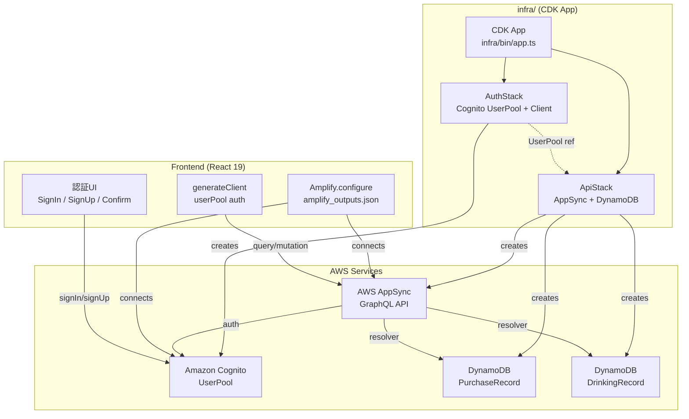
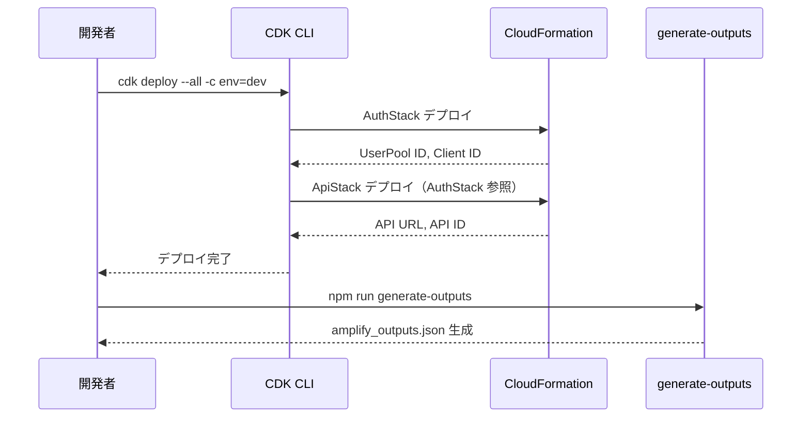
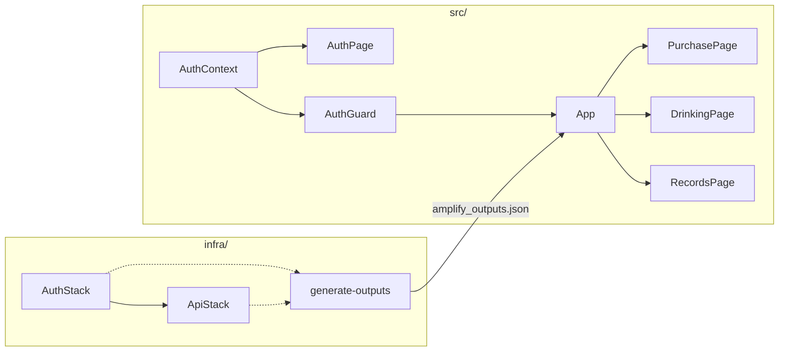
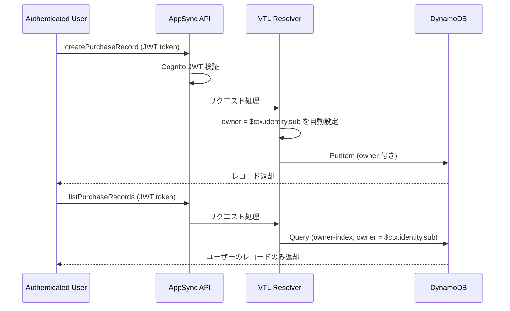

# Design Document: CDK Backend & Auth

## Overview

sakekasu-builder.com のバックエンドを Amplify Gen 2 から AWS CDK ベースに移行する。CDK で Cognito（認証）、AppSync + DynamoDB（データ層）を構築し、フロントエンドの既存コード（`Amplify.configure(outputs)` + `generateClient`）との互換性を維持する。

### 設計方針

1. **インフラとアプリの分離**: `infra/` ディレクトリに CDK コードを配置し、フロントエンドと独立して管理
2. **スタック分割**: Auth（Cognito）と API（AppSync + DynamoDB）を別スタックに分離し、依存関係を明示
3. **環境パラメータ化**: dev/staging/prod をコンテキストで切り替え
4. **フロントエンド互換**: `amplify_outputs.json` 互換の設定ファイルを自動生成し、既存の `Amplify.configure()` をそのまま利用
5. **オーナーベース認可**: Cognito 認証ユーザーが自身のレコードのみ操作可能

### 移行スコープ

- **移行対象**: バックエンドリソース定義（`amplify/` → `infra/`）、認証モード（apiKey → Cognito）、フロントエンドの認証UI追加
- **維持**: 既存のフロントエンド機能（購入登録、飲酒登録、記録一覧）、UIコンポーネント、テスト構成
- **削除対象**: `amplify/` ディレクトリ（CDK 移行完了後）

## Architecture

### スタック構成



### デプロイフロー



## Components and Interfaces

### CDK コンポーネント

#### 1. CDK App エントリポイント (`infra/bin/app.ts`)

```typescript
// CDK アプリケーションのエントリポイント
// 環境名をコンテキストから取得し、各スタックをインスタンス化
interface AppContext {
  env: 'dev' | 'staging' | 'prod';
}
```

#### 2. AuthStack (`infra/lib/auth-stack.ts`)

```typescript
interface AuthStackProps extends cdk.StackProps {
  envName: string; // 環境名プレフィックス
}

// 出力
interface AuthStackOutputs {
  userPoolId: string;
  userPoolClientId: string;
  region: string;
}
```

責務:
- Cognito UserPool の作成（メール認証、パスワードポリシー）
- UserPool Client の作成（SRP フロー、トークン有効期限）
- CloudFormation 出力の公開

#### 3. ApiStack (`infra/lib/api-stack.ts`)

```typescript
interface ApiStackProps extends cdk.StackProps {
  envName: string;
  userPool: cognito.UserPool; // AuthStack から受け取る
}

// 出力
interface ApiStackOutputs {
  graphqlUrl: string;
  region: string;
}
```

責務:
- AppSync GraphQL API の作成（Cognito 認証）
- GraphQL スキーマ定義（SDL ファイル）
- DynamoDB テーブル作成（PurchaseRecord, DrinkingRecord）
- リゾルバー設定（VTL テンプレートまたは JS リゾルバー）
- owner ベース認可ロジック

#### 4. 設定ファイル生成スクリプト (`infra/scripts/generate-outputs.ts`)

```typescript
// CloudFormation 出力から amplify_outputs.json 互換ファイルを生成
interface AmplifyOutputs {
  auth: {
    user_pool_id: string;
    user_pool_client_id: string;
    aws_region: string;
  };
  data: {
    url: string;
    aws_region: string;
    default_authorization_type: 'AMAZON_COGNITO_USER_POOLS';
  };
  version: '1.3';
}
```

### フロントエンドコンポーネント

#### 5. 認証コンテキスト (`src/features/auth/AuthContext.tsx`)

```typescript
interface AuthContextValue {
  user: AuthUser | null;
  isAuthenticated: boolean;
  isLoading: boolean;
  signIn: (email: string, password: string) => Promise<void>;
  signUp: (email: string, password: string) => Promise<void>;
  confirmSignUp: (email: string, code: string) => Promise<void>;
  signOut: () => Promise<void>;
}

interface AuthUser {
  userId: string;
  email: string;
}
```

#### 6. 認証UIコンポーネント

- `SignInForm`: メールアドレス + パスワードのサインインフォーム
- `SignUpForm`: 新規登録フォーム
- `ConfirmSignUpForm`: メール確認コード入力フォーム
- `AuthPage`: 上記フォームを切り替えるコンテナ
- `AuthGuard`: 認証状態に応じてコンテンツまたは認証画面を表示するラッパー

#### 7. ナビゲーション更新 (`src/App.tsx`)

- `AuthGuard` でアプリ全体をラップ
- ナビゲーションバーにサインアウトボタンを追加

### コンポーネント間の依存関係



## Data Models

### DynamoDB テーブル設計

#### PurchaseRecord テーブル

| フィールド | 型 | キー | 必須 | 説明 |
|---|---|---|---|---|
| id | String | PK | ✅ | UUID |
| owner | String | GSI-PK | ✅ | Cognito ユーザーID |
| sakeName | String | - | ✅ | 銘柄名 |
| storeName | String | - | ✅ | 購入店舗 |
| price | Number | - | ✅ | 価格 |
| purchaseDate | String | - | ✅ | 購入日（YYYY-MM-DD） |
| category | String | - | ✅ | SakeCategory enum 値 |
| memo | String | - | - | メモ |
| createdAt | String | - | ✅ | 作成日時（ISO 8601） |
| updatedAt | String | - | ✅ | 更新日時（ISO 8601） |

#### DrinkingRecord テーブル

| フィールド | 型 | キー | 必須 | 説明 |
|---|---|---|---|---|
| id | String | PK | ✅ | UUID |
| owner | String | GSI-PK | ✅ | Cognito ユーザーID |
| sakeName | String | - | ✅ | 銘柄名 |
| placeName | String | - | ✅ | 飲んだ場所 |
| price | Number | - | - | 価格 |
| drinkingDate | String | - | ✅ | 飲酒日（YYYY-MM-DD） |
| category | String | - | ✅ | SakeCategory enum 値 |
| drinkingMethod | String | - | ✅ | 飲み方 |
| rating | Number | - | ✅ | 評価（1-5） |
| memo | String | - | - | メモ |
| createdAt | String | - | ✅ | 作成日時（ISO 8601） |
| updatedAt | String | - | ✅ | 更新日時（ISO 8601） |

#### GSI 設計

各テーブルに `owner-index` GSI を作成:
- パーティションキー: `owner` (String)
- 射影: ALL（全属性）
- 用途: `list` クエリで認証ユーザーのレコードのみ取得

### GraphQL スキーマ

```graphql
enum SakeCategory {
  NIHONSHU
  BEER
  WINE
  WHISKY
  SHOCHU
  OTHER
}

type PurchaseRecord {
  id: ID!
  owner: String!
  sakeName: String!
  storeName: String!
  price: Int!
  purchaseDate: AWSDate!
  category: SakeCategory!
  memo: String
  createdAt: AWSDateTime!
  updatedAt: AWSDateTime!
}

type DrinkingRecord {
  id: ID!
  owner: String!
  sakeName: String!
  placeName: String!
  price: Int
  drinkingDate: AWSDate!
  category: SakeCategory!
  drinkingMethod: String!
  rating: Int!
  memo: String
  createdAt: AWSDateTime!
  updatedAt: AWSDateTime!
}

type Query {
  getPurchaseRecord(id: ID!): PurchaseRecord
  listPurchaseRecords: [PurchaseRecord!]!
  getDrinkingRecord(id: ID!): DrinkingRecord
  listDrinkingRecords: [DrinkingRecord!]!
}

type Mutation {
  createPurchaseRecord(input: CreatePurchaseRecordInput!): PurchaseRecord
  updatePurchaseRecord(input: UpdatePurchaseRecordInput!): PurchaseRecord
  deletePurchaseRecord(id: ID!): PurchaseRecord
  createDrinkingRecord(input: CreateDrinkingRecordInput!): DrinkingRecord
  updateDrinkingRecord(input: UpdateDrinkingRecordInput!): DrinkingRecord
  deleteDrinkingRecord(id: ID!): DrinkingRecord
}
```

### 認可モデル



- **Create**: リゾルバーが `$ctx.identity.sub`（Cognito ユーザーID）を `owner` フィールドに自動設定
- **List**: `owner-index` GSI を使い、`owner = $ctx.identity.sub` でフィルタ
- **Get/Update/Delete**: リゾルバーが `owner == $ctx.identity.sub` を検証し、不一致なら拒否


## Correctness Properties

*プロパティとは、システムのすべての有効な実行において成り立つべき特性や振る舞いのことです。人間が読める仕様と機械で検証可能な正しさの保証をつなぐ橋渡しの役割を果たします。*

### Property 1: 環境名がリソース名プレフィックスに反映される

*For any* 有効な環境名（dev, staging, prod）に対して、CDK スタックを合成した場合、生成される CloudFormation テンプレート内のリソース名（UserPool、DynamoDB テーブル等）にその環境名がプレフィックスとして含まれること。

**Validates: Requirements 1.4**

### Property 2: パスワードポリシーバリデーション

*For any* パスワード文字列に対して、バリデーション関数は以下をすべて満たす場合のみ有効と判定すること: 8文字以上、大文字を含む、小文字を含む、数字を含む、記号を含む。いずれか1つでも欠ける文字列は無効と判定されること。

**Validates: Requirements 2.3**

### Property 3: owner ベース認可 round-trip

*For any* 認証ユーザー A と認証ユーザー B、および任意のレコードデータに対して、ユーザー A が作成したレコードはユーザー A の list クエリで返却され、ユーザー B の list クエリでは返却されないこと。また、作成されたレコードの owner フィールドにはユーザー A の ID が自動設定されていること。

**Validates: Requirements 3.6, 7.2, 7.3**

### Property 4: 環境別削除ポリシー

*For any* 環境名に対して、DynamoDB テーブルの削除ポリシーは環境名が "prod" の場合 RETAIN、それ以外の場合 DESTROY に設定されること。

**Validates: Requirements 4.5**

### Property 5: 設定ファイル生成の構造保証

*For any* 有効な UserPool ID、UserPool Client ID、GraphQL API URL、AWS リージョンの組み合わせに対して、generate-outputs スクリプトが生成する JSON は `auth.user_pool_id`、`auth.user_pool_client_id`、`auth.aws_region`、`data.url`、`data.aws_region`、`data.default_authorization_type` フィールドをすべて含み、入力値と一致すること。

**Validates: Requirements 5.2, 5.3, 5.4**

## Error Handling

### CDK デプロイエラー

| エラー | 原因 | 対処 |
|---|---|---|
| スタック依存エラー | ApiStack が AuthStack の出力を参照できない | スタック間の依存関係を `addDependency` で明示 |
| リソース名重複 | 同一環境名で複数デプロイ | 環境名プレフィックスで一意性を保証 |
| IAM 権限不足 | CDK デプロイ用 IAM ロールの権限不足 | AdministratorAccess または必要なポリシーを付与 |

### フロントエンド認証エラー

| エラー | 原因 | 対処 |
|---|---|---|
| `NotAuthorizedException` | パスワード不一致 | 「メールアドレスまたはパスワードが正しくありません」を表示 |
| `UserNotConfirmedException` | メール未確認 | 確認コード入力画面に遷移 |
| `UsernameExistsException` | 既存メールアドレス | 「このメールアドレスは既に登録されています」を表示 |
| `CodeMismatchException` | 確認コード不一致 | 「確認コードが正しくありません」を表示 |
| `InvalidPasswordException` | パスワードポリシー違反 | ポリシー要件を表示 |
| トークン期限切れ | アクセストークン失効 | Amplify SDK が自動的にリフレッシュトークンで更新 |

### GraphQL API エラー

| エラー | 原因 | 対処 |
|---|---|---|
| 401 Unauthorized | 未認証リクエスト | サインイン画面にリダイレクト |
| owner 不一致 | 他ユーザーのレコードへのアクセス | リゾルバーが拒否、フロントエンドにエラー返却 |
| バリデーションエラー | 必須フィールド欠落 | GraphQL スキーマレベルで拒否 |

## Testing Strategy

### テストアプローチ

**ユニットテスト**と**プロパティベーステスト**の二本柱で網羅的にカバーする。

### CDK インフラテスト

**テストフレームワーク**: Vitest + `aws-cdk-lib/assertions`

**ユニットテスト** (`infra/__tests__/`):
- AuthStack の合成結果で UserPool の設定値を検証（Requirements 2.1, 2.2, 2.4, 2.5, 2.7）
- ApiStack の合成結果で AppSync API、DynamoDB テーブル、GSI の設定を検証（Requirements 3.1, 3.2, 3.3, 3.4, 3.5, 3.7, 4.1, 4.2, 4.3, 4.4, 4.6）
- CloudFormation 出力の存在確認

**プロパティベーステスト** (`infra/__tests__/`):
- ライブラリ: `fast-check`
- 最低100イテレーション
- Property 1: 環境名プレフィックス検証
- Property 4: 環境別削除ポリシー検証
- 各テストに `// Feature: cdk-backend-auth, Property N: {property_text}` タグを付与

### フロントエンド認証テスト

**テストフレームワーク**: Vitest + Testing Library + fast-check

**ユニットテスト** (`src/features/auth/__tests__/`):
- AuthContext のサインイン/サインアップ/サインアウトフロー（Requirements 6.1-6.6）
- 認証フォームのレンダリングと入力検証（Requirements 6.2, 6.3）
- AuthGuard の認証状態に応じた表示切替（Requirements 6.1, 6.5）
- エラーメッセージの表示（各認証エラーケース）

**プロパティベーステスト** (`src/features/auth/__tests__/`):
- Property 2: パスワードポリシーバリデーション
- Property 3: owner ベース認可 round-trip（モックリゾルバーで検証）
- 各テストに `// Feature: cdk-backend-auth, Property N: {property_text}` タグを付与

### 設定ファイル生成テスト

**プロパティベーステスト** (`infra/__tests__/`):
- Property 5: 設定ファイル生成の構造保証
- 任意の入力パラメータに対して出力 JSON の構造と値を検証

### テスト配置

```
infra/
  __tests__/
    auth-stack.test.ts          # AuthStack ユニットテスト
    api-stack.test.ts           # ApiStack ユニットテスト
    env-prefix.property.test.ts # Property 1: 環境名プレフィックス
    deletion-policy.property.test.ts # Property 4: 環境別削除ポリシー
    generate-outputs.property.test.ts # Property 5: 設定ファイル生成
src/
  features/
    auth/
      __tests__/
        AuthContext.test.tsx     # 認証コンテキスト ユニットテスト
        AuthPage.test.tsx        # 認証UI ユニットテスト
        password-validation.property.test.ts # Property 2: パスワードポリシー
        owner-auth.property.test.ts # Property 3: owner 認可
```

### プロパティベーステスト設定

- ライブラリ: `fast-check` (既にプロジェクトに導入済み)
- 各プロパティテストは最低100イテレーション実行
- 各テストファイルにデザインドキュメントのプロパティ番号を参照するコメントを記載
- タグフォーマット: `// Feature: cdk-backend-auth, Property {number}: {property_text}`
- 1つの correctness property に対して1つの property-based test を実装
