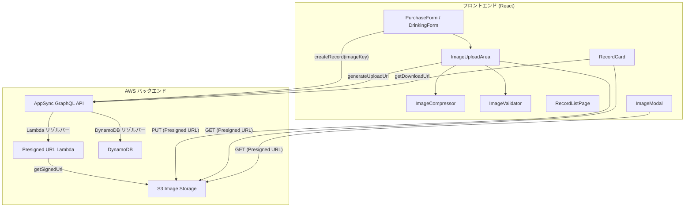
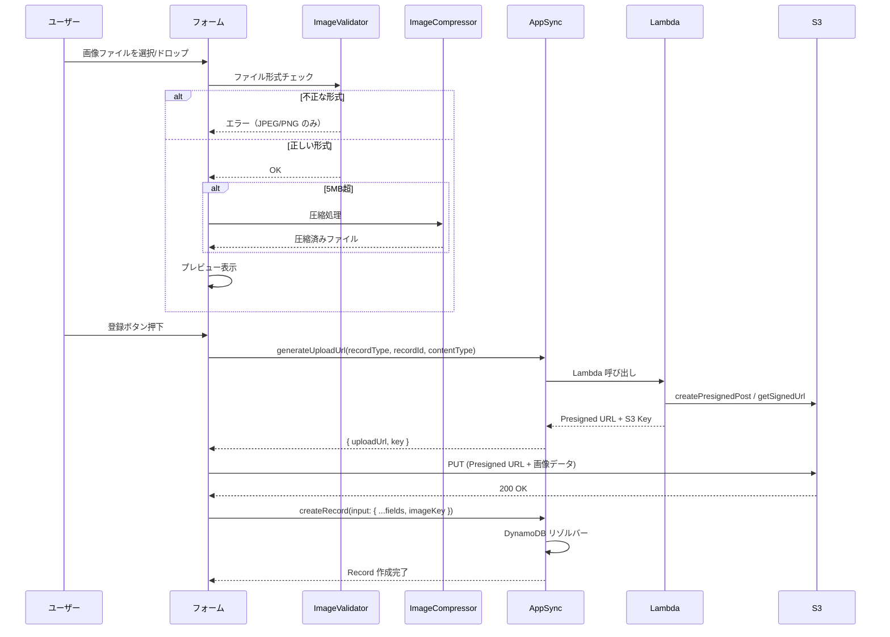
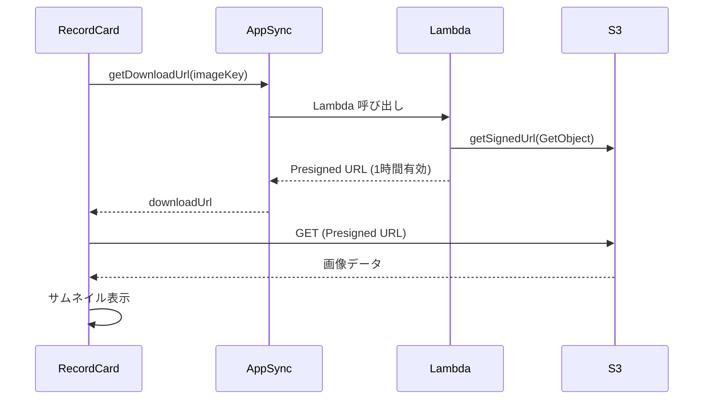
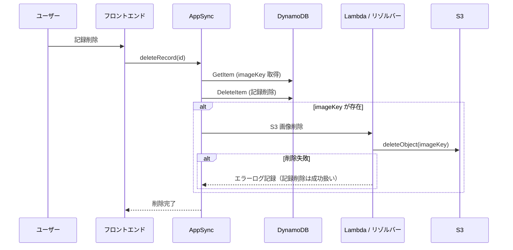

# 設計ドキュメント: 画像添付機能

## Overview

本機能は、sakekasu-builder.com の購入登録・飲酒登録フォームに画像添付機能を追加する。ユーザーはお酒のラベルや外観の写真を記録に紐づけて保存でき、一覧画面でサムネイルとして確認できる。

画像は Amazon S3 に保存し、Presigned URL を介してセキュアにアップロード・ダウンロードする。5MB を超える画像はクライアント側で Canvas API を使って自動圧縮する。記録削除時には紐づく画像も連動して削除する。

### 主要な設計判断

1. **Presigned URL 方式**: クライアントから S3 へ直接アップロードすることで、AppSync/Lambda を経由する大容量データ転送を回避
2. **Lambda リゾルバー**: Presigned URL 生成は AWS SDK が必要なため、DynamoDB リゾルバー（JS ランタイム）ではなく Lambda 関数で実装
3. **クライアント側圧縮**: サーバー側の処理コストを削減し、アップロード時間を短縮するため Canvas API で圧縮
4. **S3 キー構造**: `{owner}/{recordType}/{recordId}/{filename}` でユーザー単位のアクセス制御を実現

## Architecture

### システム構成図



### アップロードフロー



### ダウンロードフロー



### 削除連動フロー



## Components and Interfaces

### 新規コンポーネント

#### 1. ImageUploadArea（`src/features/image/components/ImageUploadArea.tsx`）

画像選択・ドラッグ＆ドロップ・プレビュー表示を担当する共通コンポーネント。

```typescript
interface ImageUploadAreaProps {
  /** 選択された画像ファイル（圧縮済み） */
  imageFile: File | null;
  /** 画像ファイル変更時のコールバック */
  onImageChange: (file: File | null) => void;
  /** 圧縮中フラグ */
  isCompressing: boolean;
  /** エラーメッセージ */
  error: string | null;
  /** 無効化フラグ */
  disabled?: boolean;
}
```

#### 2. ImageModal（`src/features/image/components/ImageModal.tsx`）

一覧画面でサムネイルクリック時に元サイズの画像を表示するモーダル。

```typescript
interface ImageModalProps {
  /** モーダル表示状態 */
  open: boolean;
  /** 表示状態変更コールバック */
  onOpenChange: (open: boolean) => void;
  /** 画像の Presigned URL */
  imageUrl: string;
  /** 銘柄名（alt テキスト用） */
  sakeName: string;
}
```

#### 3. useImageUpload フック（`src/features/image/hooks/useImageUpload.ts`）

画像アップロードのロジックを管理するカスタムフック。

```typescript
interface UseImageUploadReturn {
  /** 選択された画像ファイル */
  imageFile: File | null;
  /** 画像ファイル設定 */
  setImageFile: (file: File | null) => void;
  /** 圧縮中フラグ */
  isCompressing: boolean;
  /** アップロード中フラグ */
  isUploading: boolean;
  /** エラーメッセージ */
  error: string | null;
  /** 画像ファイル選択ハンドラ（バリデーション + 圧縮） */
  handleImageSelect: (file: File) => Promise<void>;
  /** 画像アップロード実行（Presigned URL 取得 → S3 PUT） */
  uploadImage: (recordType: string, recordId: string) => Promise<string | null>;
  /** 画像クリア */
  clearImage: () => void;
}
```

#### 4. useImageUrl フック（`src/features/image/hooks/useImageUrl.ts`）

ダウンロード用 Presigned URL の取得とキャッシュを管理するカスタムフック。

```typescript
interface UseImageUrlReturn {
  /** 画像の Presigned URL */
  imageUrl: string | null;
  /** 読み込み中フラグ */
  isLoading: boolean;
  /** エラーフラグ */
  hasError: boolean;
}
```

#### 5. ImageValidator（`src/features/image/utils/imageValidator.ts`）

```typescript
interface ValidationResult {
  valid: boolean;
  error: string | null;
}

/** ファイル形式バリデーション */
export function validateImageFile(file: File): ValidationResult;
```

#### 6. ImageCompressor（`src/features/image/utils/imageCompressor.ts`）

```typescript
interface CompressionResult {
  file: File;
  originalSize: number;
  compressedSize: number;
  wasCompressed: boolean;
}

/** 画像圧縮（5MB 超の場合のみ） */
export function compressImage(file: File): Promise<CompressionResult>;
```

### 既存コンポーネントの変更

#### PurchaseForm / DrinkingForm

- `ImageUploadArea` コンポーネントをフォーム内に追加
- `useImageUpload` フックを統合
- 登録処理に画像アップロードフローを追加（Presigned URL 取得 → S3 PUT → imageKey 付きで記録保存）

#### RecordCard

- `imageKey` が存在する場合にサムネイル（80×80px、object-fit: cover）を表示
- `useImageUrl` フックでダウンロード用 Presigned URL を取得
- 読み込み中はスケルトンローダー、失敗時はプレースホルダーアイコンを表示
- サムネイルクリックで `ImageModal` を開く

#### RecordListPage

- `ImageModal` の状態管理を追加

#### UnifiedRecord 型

- `imageKey?: string | null` フィールドを追加

#### useDeleteRecord フック

- 削除処理自体は変更不要（バックエンド側で画像削除を連動処理するため）

### ファイル構成

```
src/features/image/
  components/
    ImageUploadArea.tsx    # 画像アップロードUI
    ImageModal.tsx         # 画像拡大モーダル
  hooks/
    useImageUpload.ts      # アップロードロジック
    useImageUrl.ts         # ダウンロードURL取得
  utils/
    imageValidator.ts      # ファイル形式バリデーション
    imageCompressor.ts     # クライアント側画像圧縮
  __tests__/
    imageValidator.test.ts
    imageCompressor.test.ts
    imageValidator.property.test.ts
    imageCompressor.property.test.ts
infra/
  lambda/
    presigned-url/
      index.ts             # Presigned URL 生成 Lambda
```

## Data Models

### GraphQL スキーマ変更

```graphql
# 既存型への追加フィールド
type PurchaseRecord {
  # ... 既存フィールド
  imageKey: String           # S3 オブジェクトキー（任意）
}

type DrinkingRecord {
  # ... 既存フィールド
  imageKey: String           # S3 オブジェクトキー（任意）
}

# 既存 Input への追加フィールド
input CreatePurchaseRecordInput {
  # ... 既存フィールド
  imageKey: String
}

input CreateDrinkingRecordInput {
  # ... 既存フィールド
  imageKey: String
}

# 新規: Presigned URL 関連
type PresignedUrlResponse {
  uploadUrl: String!
  key: String!
}

type Query {
  # ... 既存クエリ
  getDownloadUrl(key: String!): String!
}

type Mutation {
  # ... 既存ミューテーション
  generateUploadUrl(
    recordType: String!
    recordId: String!
    contentType: String!
    fileName: String!
  ): PresignedUrlResponse!
}
```

### S3 オブジェクトキー構造

```
{owner_sub}/{recordType}/{recordId}/{filename}
```

例: `abc123-def456/purchase/rec-789/label.jpg`

- `owner_sub`: Cognito ユーザーの sub（UUID）
- `recordType`: `purchase` または `drinking`
- `recordId`: 記録の ID
- `filename`: 元のファイル名

### DynamoDB テーブル変更

既存の PurchaseRecord / DrinkingRecord テーブルに `imageKey` 属性を追加。DynamoDB はスキーマレスのため、テーブル定義の変更は不要。既存レコードの `imageKey` は `undefined`（属性なし）として扱われ、後方互換性を維持する。

### TypeScript 型定義の変更

```typescript
// src/types/schema.ts
export interface PurchaseRecordType extends BaseRecord {
  // ... 既存フィールド
  imageKey: string | null;
}

export interface DrinkingRecordType extends BaseRecord {
  // ... 既存フィールド
  imageKey: string | null;
}

// src/features/records/types.ts
export interface UnifiedRecord {
  // ... 既存フィールド
  imageKey?: string | null;
}
```

### CDK インフラ変更

#### S3 バケット（ApiStack に追加）

```typescript
const imageBucket = new s3.Bucket(this, 'ImageStorage', {
  bucketName: `${props.envName}-sakekasu-images`,
  blockPublicAccess: s3.BlockPublicAccess.BLOCK_ALL,
  encryption: s3.BucketEncryption.S3_MANAGED,
  removalPolicy: removalPolicy, // 既存の removalPolicy 変数を再利用
  cors: [{
    allowedOrigins: ['https://sakekasu-builder.com', 'http://localhost:5173'],
    allowedMethods: [s3.HttpMethod.PUT, s3.HttpMethod.GET],
    allowedHeaders: ['*'],
    maxAge: 3600,
  }],
});
```

#### Presigned URL Lambda

```typescript
const presignedUrlFunction = new lambda.Function(this, 'PresignedUrlFunction', {
  functionName: `${props.envName}-sakekasu-presigned-url`,
  runtime: lambda.Runtime.NODEJS_20_X,
  handler: 'index.handler',
  code: lambda.Code.fromAsset(path.join(__dirname, '../lambda/presigned-url')),
  environment: {
    BUCKET_NAME: imageBucket.bucketName,
    UPLOAD_EXPIRY: '300',
    DOWNLOAD_EXPIRY: '3600',
  },
});

imageBucket.grantReadWrite(presignedUrlFunction);
```

#### AppSync Lambda データソース

```typescript
const lambdaDataSource = this.graphqlApi.addLambdaDataSource(
  'PresignedUrlDataSource',
  presignedUrlFunction,
);

// generateUploadUrl ミューテーション
lambdaDataSource.createResolver('GenerateUploadUrlResolver', {
  typeName: 'Mutation',
  fieldName: 'generateUploadUrl',
});

// getDownloadUrl クエリ
lambdaDataSource.createResolver('GetDownloadUrlResolver', {
  typeName: 'Query',
  fieldName: 'getDownloadUrl',
});
```

#### 削除リゾルバーの変更

既存の `deleteRecord` リゾルバーを Pipeline リゾルバーに変更し、以下の 2 ステップで処理する:

1. DynamoDB から記録を取得（imageKey を含む）して削除
2. imageKey が存在する場合、Lambda 経由で S3 から画像を削除

Lambda 関数に S3 削除権限を追加し、画像削除失敗時はエラーをログに記録するが、記録の削除自体は成功として返す。

