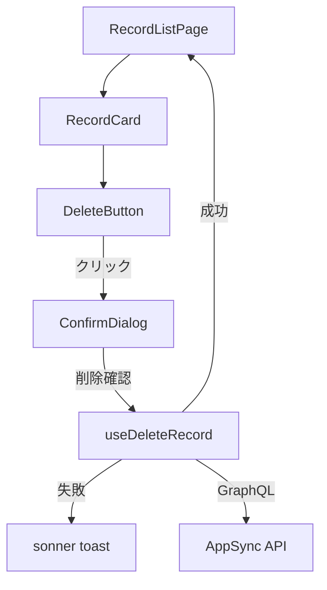
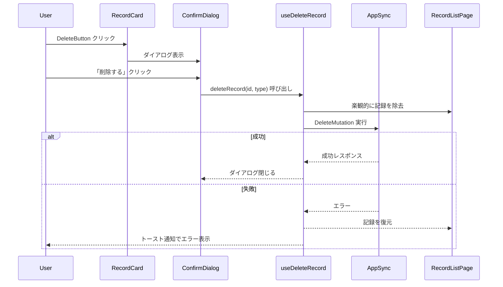

# 設計ドキュメント: 記録の削除機能

## 概要

購入記録・飲酒記録を一覧画面（RecordListPage）から個別に削除する機能のフロントエンド実装設計。バックエンド側の削除API（AppSync GraphQL ミューテーション `deletePurchaseRecord` / `deleteDrinkingRecord`）は実装済みであり、本設計はフロントエンドのUI・ロジックに焦点を当てる。

主な設計方針:
- 既存の `RecordCard` に削除ボタンを追加し、確認ダイアログ経由で削除を実行
- 楽観的UI更新で即座に一覧から除去し、失敗時はロールバック
- Framer Motion の `AnimatePresence` + `layoutId` で滑らかな削除アニメーション
- sonner（トースト通知）でエラーフィードバック

## アーキテクチャ

### コンポーネント構成



### データフロー



## コンポーネントとインターフェース

### 1. DeleteButton コンポーネント

`RecordCard` 内に配置される削除ボタン。ゴミ箱アイコン（lucide-react の `Trash2`）を使用。

```typescript
interface DeleteButtonProps {
  onClick: () => void;
  disabled: boolean;
}
```

- ファイル: `src/features/records/components/DeleteButton.tsx`
- `aria-label="削除"` でアクセシビリティ対応
- `disabled` 時はクリック不可・視覚的にグレーアウト

### 2. ConfirmDialog コンポーネント

削除確認用モーダルダイアログ。shadcn/ui の Dialog コンポーネントは現在プロジェクトに未導入のため、`@base-ui/react` の Dialog または独自実装で対応する。

```typescript
interface ConfirmDialogProps {
  open: boolean;
  onOpenChange: (open: boolean) => void;
  sakeName: string;
  recordType: 'purchase' | 'drinking';
  isDeleting: boolean;
  onConfirm: () => void;
}
```

- ファイル: `src/features/records/components/ConfirmDialog.tsx`
- Escape キーでダイアログを閉じる
- 背景スクロール無効化
- フォーカストラップ（ダイアログ内にフォーカスを閉じ込める）
- 「削除する」ボタンは `isDeleting` 時にローディングインジケーター表示 + disabled

### 3. useDeleteRecord カスタムフック

削除処理のロジックをカプセル化するフック。

```typescript
interface UseDeleteRecordReturn {
  deleteRecord: (id: string, type: RecordType) => Promise<void>;
  isDeleting: boolean;
}

function useDeleteRecord(
  onOptimisticRemove: (id: string) => void,
  onRollback: (record: UnifiedRecord) => void,
  onSuccess: () => void,
): UseDeleteRecordReturn;
```

- ファイル: `src/features/records/hooks/useDeleteRecord.ts`
- `type` に応じて `deletePurchaseRecord` / `deleteDrinkingRecord` を呼び分け
- 楽観的UI更新: ミューテーション実行前に `onOptimisticRemove` で一覧から除去
- 失敗時: `onRollback` で記録を復元 + sonner の `toast.error()` でエラー通知
- 成功時: `onSuccess` でダイアログを閉じる

### 4. RecordCard の拡張

既存の `RecordCard` に `DeleteButton` と削除状態管理を追加。

```typescript
interface RecordCardProps {
  record: UnifiedRecord;
  onDelete: (id: string, type: RecordType) => void;
  isDeleting: boolean;
}
```

### 5. RecordListPage の拡張

`useDeleteRecord` フックを統合し、楽観的UI更新のための状態管理を追加。

- `useRecordFetch` から取得した `records` をローカル state にコピーし、楽観的な除去・復元を管理
- Framer Motion の `AnimatePresence` で記録カードの削除アニメーションを実現
- `layout` プロパティで残りカードの再配置アニメーション

## データモデル

### 既存型（変更なし）

```typescript
// src/features/records/types.ts - 既存
interface UnifiedRecord {
  id: string;
  type: RecordType;  // 'purchase' | 'drinking'
  sakeName: string;
  price: number | null;
  date: string;
  category: SakeCategory;
  memo?: string;
  storeName?: string;
  placeName?: string;
  drinkingMethod?: string;
  rating?: number;
  createdAt: string;
  updatedAt: string;
}
```

### 削除関連の状態型（新規）

```typescript
// useDeleteRecord 内部で使用
interface DeleteState {
  isDeleting: boolean;
  deletingId: string | null;
}
```

### GraphQL ミューテーション（既存・変更なし）

```graphql
mutation DeletePurchaseRecord($id: ID!) {
  deletePurchaseRecord(id: $id) { id }
}

mutation DeleteDrinkingRecord($id: ID!) {
  deleteDrinkingRecord(id: $id) { id }
}
```


## 正当性プロパティ（Correctness Properties）

*プロパティとは、システムのすべての有効な実行において成り立つべき特性や振る舞いのことです。人間が読める仕様と機械的に検証可能な正当性保証の橋渡しとなる、形式的な記述です。*

### Property 1: 確認ダイアログに銘柄名と記録種別が含まれる

*任意の*銘柄名（空でない文字列）と記録種別（purchase または drinking）に対して、ConfirmDialog をレンダリングした場合、表示されるテキストにその銘柄名と記録種別の日本語ラベル（「購入」または「飲酒」）が含まれること。

**Validates: Requirements 2.1**

### Property 2: 記録種別に応じた適切なミューテーション選択

*任意の* UnifiedRecord に対して、削除処理を実行した場合、`type` が `'purchase'` なら `deletePurchaseRecord` ミューテーションが、`'drinking'` なら `deleteDrinkingRecord` ミューテーションが呼び出されること。

**Validates: Requirements 3.1**

### Property 3: 削除成功時の一覧からの除去

*任意の*記録リスト（1件以上）から任意の1件を削除した場合、削除成功後の一覧にはその記録の `id` を持つ要素が含まれず、かつ一覧の長さが元のリストより1少ないこと。

**Validates: Requirements 3.2**

### Property 4: 削除失敗時の記録復元

*任意の*記録リストから任意の1件の削除が失敗した場合、ロールバック後の一覧は元のリストと同一の要素を含み、長さも同一であること。

**Validates: Requirements 4.2**

## エラーハンドリング

### ネットワーク・サーバーエラー

| エラー種別 | 対応 |
|---|---|
| GraphQL ミューテーション失敗（ネットワークエラー） | 楽観的に除去した記録を復元 + `toast.error("削除に失敗しました。もう一度お試しください。")` |
| GraphQL ミューテーション失敗（サーバーエラー） | 同上 |
| 認証エラー（Cognito トークン期限切れ等） | Amplify の認証フローに委譲（既存の認証エラーハンドリングを利用） |

### UI状態の整合性

- 削除処理中（`isDeleting: true`）は DeleteButton と ConfirmDialog の「削除する」ボタンを disabled にし、二重送信を防止
- 楽観的UI更新の失敗時は必ず元の記録を復元し、データの不整合を防止
- ConfirmDialog は成功時に自動で閉じ、失敗時は開いたまま再試行可能

## テスト戦略

### テストフレームワーク

- **ユニットテスト**: Vitest + Testing Library
- **プロパティベーステスト**: Vitest + fast-check
- テストファイルは `src/features/records/__tests__/` に配置

### ユニットテスト

具体的なシナリオやエッジケース、UIインタラクションを検証する。

| テスト対象 | テスト内容 | 対応要件 |
|---|---|---|
| RecordCard | DeleteButton がレンダリングされること | 1.1 |
| DeleteButton | `aria-label="削除"` が設定されていること | 1.2 |
| DeleteButton | `isDeleting=true` 時に disabled であること | 1.3 |
| ConfirmDialog | 「削除する」「キャンセル」ボタンが表示されること | 2.2 |
| ConfirmDialog | キャンセルクリックで `onOpenChange(false)` が呼ばれ、`onConfirm` が呼ばれないこと | 2.3 |
| ConfirmDialog | Escape キーで `onOpenChange(false)` が呼ばれること | 2.4 |
| ConfirmDialog | 削除成功時にダイアログが閉じること | 3.3 |
| RecordListPage | 削除失敗時にエラートーストが表示されること | 4.1 |
| ConfirmDialog | `isDeleting=true` 時に「削除する」ボタンが disabled でローディング表示されること | 4.3 |

### プロパティベーステスト

各テストは最低100回のイテレーションで実行する。各テストには設計ドキュメントのプロパティ番号をコメントで参照する。

| テスト | タグ | 対応プロパティ |
|---|---|---|
| 確認メッセージに銘柄名・種別が含まれる | `Feature: record-deletion, Property 1: 確認ダイアログに銘柄名と記録種別が含まれる` | Property 1 |
| recordTypeに応じたミューテーション選択 | `Feature: record-deletion, Property 2: 記録種別に応じた適切なミューテーション選択` | Property 2 |
| 削除成功時の一覧更新 | `Feature: record-deletion, Property 3: 削除成功時の一覧からの除去` | Property 3 |
| 削除失敗時の記録復元 | `Feature: record-deletion, Property 4: 削除失敗時の記録復元` | Property 4 |

### テストファイル構成

```
src/features/records/__tests__/
  DeleteButton.test.tsx          # DeleteButton ユニットテスト
  ConfirmDialog.test.tsx         # ConfirmDialog ユニットテスト
  delete.property.test.tsx       # 削除機能プロパティベーステスト
  RecordListPage.delete.test.tsx # RecordListPage 削除統合テスト
```
