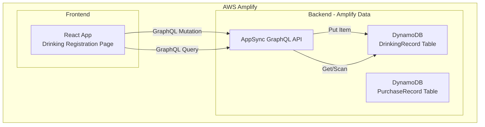
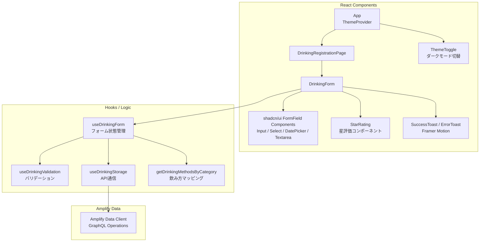

# 技術設計ドキュメント: 飲んだお酒の登録

## Overview

本設計は「sakekasu-builder.com」の機能2として、飲んだお酒の情報を登録するページの技術設計を定義する。ユーザーはWebフォームを通じて飲酒情報（銘柄名、飲んだ場所、価格、飲んだ日、カテゴリ、飲み方、提供形態、評価、メモ）を入力し、AWSバックエンドに保存できる。

既存の購入登録機能（sake-purchase-registration）と同じ技術スタック・設計パターンを踏襲し、`SakeCategory`列挙型を共有する。

### 技術スタック

- **フロントエンド**: React 19 + TypeScript 5.9（AWS Amplify Gen 2でホスティング）
- **UIライブラリ**: Tailwind CSS v4 + shadcn/ui（@base-ui/react ベース）+ Framer Motion
- **バックエンド**: AWS Amplify Data（AppSync GraphQL API + DynamoDB）
- **テスト**: Vitest + Testing Library + fast-check

### 設計方針

- 既存の購入登録機能と同じアーキテクチャパターン（カスタムフック分離、shadcn/uiベースのUI）を踏襲する
- `SakeCategory`は既存の`src/features/purchase/types.ts`から共有利用する（将来的に`src/shared/types.ts`への移動を検討）
- `Drinking_Method`はカテゴリに連動して動的に変わるため、マッピングロジックを型安全に実装する
- 星評価UIは再利用可能なコンポーネントとして設計する
- 連続登録時の「飲んだ場所」保持は、フォームリセットロジックで制御する

### UIデザイン方針

購入登録機能と統一された「和モダン」デザインを踏襲する。

- **デザインテーマ**: 和モダン — 購入登録と同じカラーパレット・タイポグラフィを使用
- **レスポンシブデザイン**: モバイルファーストで設計。スマホでの片手操作を考慮
- **ダークモード**: 既存のThemeProvider/ThemeToggleを共有利用
- **アニメーション**: Framer Motionで購入登録と同様のマイクロインタラクションを実装
- **星評価UI**: 5つの星アイコンをタップ/クリックで操作。選択済みの星は塗りつぶし、未選択は空の状態で表示

## Architecture

### システム構成図



### コンポーネント構成図



## Components and Interfaces

### 1. Amplify Data Schema 拡張（`amplify/data/resource.ts`）

既存スキーマに`ServingStyle`列挙型と`DrinkingRecord`モデルを追加する。`SakeCategory`は既存のものを共有する。

```typescript
// amplify/data/resource.ts（追加分）
const schema = a.schema({
  // 既存
  SakeCategory: a.enum(['NIHONSHU', 'BEER', 'WINE', 'WHISKY', 'SHOCHU', 'OTHER']),

  // 既存
  PurchaseRecord: a.model({ /* ... */ }),

  // 新規追加
  ServingStyle: a.enum(['GLASS', 'ICHIGO', 'BOTTLE', 'CAN', 'OTHER']),

  DrinkingRecord: a.model({
    sakeName: a.string().required(),
    placeName: a.string().required(),
    price: a.integer(),
    drinkingDate: a.date().required(),
    category: a.ref('SakeCategory').required(),
    drinkingMethod: a.string().required(),
    servingStyle: a.ref('ServingStyle').required(),
    rating: a.integer().required(),
    memo: a.string(),
  }).authorization(allow => [allow.publicApiKey()]),
});
```

> **設計判断**:
> - `drinkingMethod`は`string`型とする。カテゴリごとに選択肢が異なり、将来的な拡張性を考慮して列挙型ではなく文字列で保存する。バリデーションはフロントエンドで行う。
> - `price`は`a.integer()`（null許可）とする。購入登録の`price`は`required()`だが、飲酒登録では任意フィールドのため。
> - `rating`は1〜5の整数。範囲制約はフロントエンドのバリデーションで担保する。

### 2. 飲み方マッピング（`getDrinkingMethodsByCategory`）

カテゴリに応じた飲み方の選択肢を返すユーティリティ関数。

```typescript
// src/features/drinking/types.ts

export type DrinkingMethod = string;

export const DRINKING_METHODS_MAP: Record<SakeCategory, DrinkingMethod[]> = {
  NIHONSHU: ['冷酒', '常温', 'ぬる燗', '熱燗', 'その他'],
  BEER: ['生', '瓶', '缶', 'その他'],
  WINE: ['そのまま', 'その他'],
  WHISKY: ['ストレート', 'ロック', '水割り', 'ハイボール', 'トワイスアップ', 'ミスト', 'その他'],
  SHOCHU: ['ストレート', 'ロック', '水割り', 'お湯割り', 'ソーダ割り', 'その他'],
  OTHER: ['その他'],
};

export function getDrinkingMethodsByCategory(category: SakeCategory): DrinkingMethod[] {
  return DRINKING_METHODS_MAP[category] ?? ['その他'];
}
```

### 3. ServingStyle 定義

```typescript
export type ServingStyle = 'GLASS' | 'ICHIGO' | 'BOTTLE' | 'CAN' | 'OTHER';

export const SERVING_STYLES: ServingStyle[] = ['GLASS', 'ICHIGO', 'BOTTLE', 'CAN', 'OTHER'];

export const SERVING_STYLE_LABELS: Record<ServingStyle, string> = {
  GLASS: 'グラス',
  ICHIGO: '一合',
  BOTTLE: 'ボトル',
  CAN: '缶',
  OTHER: 'その他',
};
```

### 4. DrinkingForm コンポーネント

フォームの表示とユーザー入力を管理するメインコンポーネント。

```typescript
interface DrinkingFormProps {
  onSubmitSuccess: () => void;
}

interface DrinkingFormData {
  sakeName: string;
  placeName: string;
  price: string;           // 入力時は文字列、送信時にnumber|nullへ変換
  drinkingDate: string;    // YYYY-MM-DD形式
  category: SakeCategory;
  drinkingMethod: string;
  servingStyle: ServingStyle;
  rating: number;          // 1〜5、未選択時は0
  memo: string;
}

interface DrinkingValidationErrors {
  sakeName?: string;
  placeName?: string;
  price?: string;
  drinkingDate?: string;
  category?: string;
  drinkingMethod?: string;
  servingStyle?: string;
  rating?: string;
}
```

**使用するshadcn/uiコンポーネント:**

| フィールド | コンポーネント | 備考 |
|-----------|--------------|------|
| 銘柄名 | `<Input />` | プレースホルダー付き |
| 飲んだ場所 | `<Input />` | 連続登録時に前回値を保持 |
| 価格 | `<Input type="number" />` | 任意。円マーク接頭辞付き |
| 飲んだ日 | `<Popover />` + `<Calendar />` | 初期値は当日 |
| カテゴリ | `<Select />` | 変更時にDrinking_Methodをリセット |
| 飲み方 | `<Select />` | カテゴリに連動して選択肢が動的に変化 |
| 提供形態 | `<Select />` | グラス、一合、ボトル、缶、その他 |
| 評価 | `StarRating` | カスタム星評価コンポーネント |
| メモ | `<Textarea />` | リサイズ可能 |
| 登録ボタン | `<Button />` | 送信中はローディングスピナー表示 |

**UIレイアウト:**

```
┌─────────────────────────────────────────────┐
│  🍶 飲んだお酒を登録          [🌙 ダーク切替] │
│                                             │
│  ┌─ Card (グラスモーフィズム) ─────────────┐  │
│  │                                       │  │
│  │  銘柄名     [________________]        │  │
│  │  飲んだ場所 [________________]        │  │
│  │  価格       [¥ _____________ ]        │  │
│  │  飲んだ日   [📅 2025/01/01   ]        │  │
│  │  カテゴリ   [▼ 日本酒        ]        │  │
│  │  飲み方     [▼ 冷酒          ]        │  │
│  │  提供形態   [▼ グラス        ]        │  │
│  │  評価       ★★★★☆  4/5             │  │
│  │  メモ       [________________]        │  │
│  │             [________________]        │  │
│  │                                       │  │
│  │         [ 🍶 登録する ]               │  │
│  │                                       │  │
│  └───────────────────────────────────────┘  │
│                                             │
│  ✅ 登録が完了しました（トースト通知）        │
└─────────────────────────────────────────────┘
```

### 5. StarRating コンポーネント

再利用可能な星評価UIコンポーネント。

```typescript
interface StarRatingProps {
  value: number;           // 現在の評価値（0=未選択、1〜5）
  onChange: (rating: number) => void;
  maxStars?: number;       // デフォルト5
}
```

- 5つの星アイコン（lucide-reactの`Star`）を横並びで表示
- クリックで評価値を設定（クリックされた星までを塗りつぶし）
- 現在の数値を星の横にテキスト表示（例: "4/5"）
- 初期値は未選択状態（value=0、全て空の星）
- ホバー時にプレビュー表示（Framer Motionでスケールアニメーション）

### 6. useDrinkingValidation フック

```typescript
interface UseDrinkingValidationReturn {
  errors: DrinkingValidationErrors;
  validateField: (field: keyof DrinkingFormData, value: string | number) => string | undefined;
  validateAll: (data: DrinkingFormData) => DrinkingValidationErrors;
  isValid: (data: DrinkingFormData) => boolean;
  clearErrors: () => void;
}
```

**バリデーションルール:**

| フィールド | ルール |
|-----------|--------|
| sakeName | 空文字・空白のみ不可。「銘柄名は必須です」 |
| placeName | 空文字・空白のみ不可。「飲んだ場所は必須です」 |
| price | 任意。入力時は0以上の整数のみ。「価格は0以上の数値で入力してください」 |
| drinkingDate | 必須。未来の日付は不可。「飲んだ日は本日以前の日付を入力してください」 |
| category | 必須。定義済みカテゴリのいずれか |
| drinkingMethod | 必須。選択されたカテゴリに対応する飲み方のいずれか |
| servingStyle | 必須。定義済み提供形態のいずれか |
| rating | 必須。1〜5の整数。「評価を選択してください」 |

### 7. useDrinkingStorage フック

```typescript
interface UseDrinkingStorageReturn {
  saveDrinking: (data: DrinkingFormData) => Promise<SaveResult>;
  isSaving: boolean;
}
```

### 8. useDrinkingForm フック

フォーム全体の状態管理を行うカスタムフック。連続登録時の「飲んだ場所」保持ロジックを含む。

```typescript
interface UseDrinkingFormReturn {
  formData: DrinkingFormData;
  errors: DrinkingValidationErrors;
  isSaving: boolean;
  isFormValid: boolean;
  handleChange: (field: keyof DrinkingFormData, value: string | number) => void;
  handleSubmit: () => Promise<void>;
  successMessage: string | null;
  errorMessage: string | null;
}
```

**アニメーション仕様:**

| 要素 | アニメーション | ライブラリ |
|------|--------------|-----------|
| フォームカード | ページ表示時にフェードイン + 下からスライド | Framer Motion |
| 登録ボタン | ホバー時にスケールアップ（1.02倍）+ 色変化 | Tailwind CSS transition |
| 成功メッセージ | 右上からスライドイン → 3秒後にフェードアウト | Framer Motion |
| エラーメッセージ | シェイクアニメーション | Framer Motion |
| 星評価 | ホバー時にスケールアップ、クリック時にバウンス | Framer Motion |
| バリデーションエラー | フィールド下にスライドダウンで表示 | Framer Motion AnimatePresence |

## Data Models

### DrinkingRecord（DynamoDB テーブル）

Amplify Dataにより自動生成されるDynamoDBテーブル。

| フィールド | 型 | 必須 | 説明 |
|-----------|-----|------|------|
| id | String (UUID) | ✅ | 自動生成される一意のID |
| sakeName | String | ✅ | 銘柄名 |
| placeName | String | ✅ | 飲んだ場所 |
| price | Integer | ❌ | 価格（0以上、null許可） |
| drinkingDate | AWSDate | ✅ | 飲んだ日（YYYY-MM-DD） |
| category | SakeCategory (Enum) | ✅ | お酒のカテゴリ |
| drinkingMethod | String | ✅ | 飲み方（カテゴリに連動） |
| servingStyle | ServingStyle (Enum) | ✅ | 提供形態 |
| rating | Integer | ✅ | 評価（1〜5） |
| memo | String | ❌ | メモ（空文字許可） |
| createdAt | AWSDateTime | ✅ | 登録日時（自動生成） |
| updatedAt | AWSDateTime | ✅ | 更新日時（自動生成） |

### SakeCategory（列挙型）— 既存共有

| 値 | 表示名 |
|----|--------|
| NIHONSHU | 日本酒 |
| BEER | ビール |
| WINE | ワイン |
| WHISKY | ウイスキー |
| SHOCHU | 焼酎 |
| OTHER | その他 |

### ServingStyle（列挙型）— 新規

| 値 | 表示名 |
|----|--------|
| GLASS | グラス |
| ICHIGO | 一合 |
| BOTTLE | ボトル |
| CAN | 缶 |
| OTHER | その他 |

### Drinking_Method マッピング

| カテゴリ | 飲み方選択肢 |
|---------|-------------|
| 日本酒 | 冷酒、常温、ぬる燗、熱燗、その他 |
| ビール | 生、瓶、缶、その他 |
| ワイン | そのまま、その他 |
| ウイスキー | ストレート、ロック、水割り、ハイボール、トワイスアップ、ミスト、その他 |
| 焼酎 | ストレート、ロック、水割り、お湯割り、ソーダ割り、その他 |
| その他 | その他 |

### DynamoDB アクセスパターン

| パターン | 操作 | 用途 |
|---------|------|------|
| 飲酒記録の作成 | CreateDrinkingRecord Mutation | 新規飲酒情報の登録 |
| 登録日時降順で取得 | ListDrinkingRecords Query (sortDirection: DESC) | 将来の一覧表示機能で使用 |


## Correctness Properties

*プロパティとは、システムの全ての有効な実行において真であるべき特性や振る舞いのことである。プロパティは人間が読める仕様と機械的に検証可能な正しさの保証をつなぐ橋渡しの役割を果たす。*

### Property 1: カテゴリ変更時の飲み方連動

*For any* SakeCategoryの値に対して、そのカテゴリを選択したとき、Drinking_Methodの選択肢はそのカテゴリに対応する飲み方リストと一致し、かつ以前選択されていたDrinking_Methodの値はリセット（空文字）されるべきである。

**Validates: Requirements 1.4, 1.5**

### Property 2: 必須フィールド空欄バリデーション

*For any* 必須フィールド（銘柄名、飲んだ場所、飲んだ日、Sake_Category、Drinking_Method、Serving_Style、Rating）のうち、任意の1つ以上が空または未選択である入力データに対して、バリデーションは失敗を返し、該当フィールドにエラーメッセージが設定されるべきである。

**Validates: Requirements 2.1**

### Property 3: 無効な価格入力バリデーション

*For any* 数値以外の文字列、または負の数値が価格として入力された場合、バリデーションは失敗を返し、「価格は0以上の数値で入力してください」というエラーメッセージが設定されるべきである。

**Validates: Requirements 2.2, 2.3**

### Property 4: 未来日付バリデーション

*For any* 本日より後の日付が飲んだ日として入力された場合、バリデーションは失敗を返し、「飲んだ日は本日以前の日付を入力してください」というエラーメッセージが設定されるべきである。

**Validates: Requirements 2.4**

### Property 5: Rating範囲制限

*For any* 1から5の範囲外の整数値がRatingとして設定された場合、システムはその値を1から5の範囲内にクランプすべきである（0以下は1に、6以上は5に）。

**Validates: Requirements 2.5**

### Property 6: 有効入力のバリデーション通過

*For any* 全ての必須フィールドが正しく入力されたデータ（銘柄名・場所名が非空白文字列、飲んだ日が本日以前、カテゴリが有効な列挙値、飲み方がカテゴリに対応する値、提供形態が有効な列挙値、Ratingが1〜5、価格が未入力または0以上の整数）に対して、バリデーションは成功を返すべきである。

**Validates: Requirements 2.6**

### Property 7: 保存成功後のフォームリセット（飲んだ場所保持）

*For any* 有効な入力データで保存が成功した場合、フォームの全フィールドは初期状態にリセットされるべきである。ただし「飲んだ場所」フィールドのみ前回の入力値を保持すべきである。

**Validates: Requirements 3.3, 5.1, 5.3**

### Property 8: 保存失敗時の入力保持

*For any* 有効な入力データで保存が失敗した場合、フォームの全フィールドは送信前の入力値をそのまま保持すべきである。

**Validates: Requirements 3.5**

### Property 9: DrinkingRecordのラウンドトリップ

*For any* 有効なDrinkingRecord（有効な銘柄名、場所名、本日以前の日付、有効なカテゴリ、対応する飲み方、有効な提供形態、1〜5のRating、任意の価格・メモ）に対して、Drinking_Storageに保存した後に取得した結果は、元のDrinkingRecordと同等の内容（銘柄名、場所名、価格、飲んだ日、カテゴリ、飲み方、提供形態、Rating、メモ）を持つべきである。

**Validates: Requirements 4.3**

### Property 10: 登録日時降順取得

*For any* 複数のDrinkingRecordの集合に対して、Drinking_Storageから取得した結果は登録日時（createdAt）の降順で並んでいるべきである。

**Validates: Requirements 4.2**

### Property 11: 連続登録時の成功メッセージ表示

*For any* N回（N >= 2）の連続した有効な登録操作に対して、各登録成功後に成功メッセージが表示されるべきである。

**Validates: Requirements 5.2**

### Property 12: 星評価UIの表示状態

*For any* 1〜5の評価値に対して、StarRatingコンポーネントはその値までの星を塗りつぶし状態で表示し、残りを空の状態で表示し、かつ現在の数値をテキストで表示すべきである。

**Validates: Requirements 6.2, 6.3**

## Error Handling

### バリデーションエラー

| エラー条件 | エラーメッセージ | 表示位置 |
|-----------|----------------|---------|
| 必須フィールドが空 | 「{フィールド名}は必須です」 | 該当フィールドの横 |
| 価格が数値以外または負の値 | 「価格は0以上の数値で入力してください」 | 価格フィールドの横 |
| 飲んだ日が未来の日付 | 「飲んだ日は本日以前の日付を入力してください」 | 飲んだ日フィールドの横 |
| Ratingが未選択 | 「評価を選択してください」 | 星評価UIの横 |

### API通信エラー

| エラー条件 | ユーザーへの表示 | システム動作 |
|-----------|----------------|-------------|
| ネットワークエラー | 「登録に失敗しました。もう一度お試しください」 | 入力内容を保持、再送信可能 |
| AppSync APIエラー | 「登録に失敗しました。もう一度お試しください」 | 入力内容を保持、再送信可能 |
| DynamoDB書き込みエラー | 「登録に失敗しました。もう一度お試しください」 | 入力内容を保持、再送信可能 |

### エラーハンドリング方針

- バリデーションエラーはフィールド単位でリアルタイムに表示する（onBlur時）。Framer MotionのAnimatePresenceでスムーズに表示・非表示を切り替える
- API通信エラーはshadcn/uiの`<Toast />`（sonner）コンポーネントで画面右上に表示する
- エラー発生時は入力内容を保持し、ユーザーが修正・再送信できる状態を維持する
- コンソールにはデバッグ用の詳細エラー情報をログ出力する

## Testing Strategy

### テスト方針

本機能では、ユニットテストとプロパティベーステストの2つのアプローチを組み合わせて包括的なテストカバレッジを実現する。

### プロパティベーステスト

**ライブラリ**: [fast-check](https://github.com/dubzzz/fast-check)（TypeScript向けプロパティベーステストライブラリ）

**設定**:
- 各プロパティテストは最低100回のイテレーションを実行する
- 各テストにはデザインドキュメントのプロパティ番号をタグとしてコメントに記載する
- タグ形式: `Feature: sake-drinking-registration, Property {number}: {property_text}`
- 1つのCorrectnessプロパティにつき1つのプロパティベーステストを実装する

**テスト対象プロパティ**:

| プロパティ | テスト内容 | ジェネレータ |
|-----------|-----------|-------------|
| Property 1 | カテゴリ変更時の飲み方連動 | ランダムなSakeCategoryペア（変更前・変更後） |
| Property 2 | 必須フィールド空欄でバリデーション失敗 | 必須フィールドのランダムな部分集合を空にした入力データ |
| Property 3 | 無効な価格でバリデーション失敗 | 非数値文字列、負の数値のランダム生成 |
| Property 4 | 未来日付でバリデーション失敗 | 明日以降のランダムな日付 |
| Property 5 | Rating範囲制限 | 1〜5の範囲外のランダムな整数 |
| Property 6 | 有効入力でバリデーション成功 | 全フィールドが有効なランダム入力データ |
| Property 7 | 保存成功後のフォームリセット（場所保持） | ランダムな有効入力データ + 保存成功モック |
| Property 8 | 保存失敗時の入力保持 | ランダムな有効入力データ + 保存失敗モック |
| Property 9 | DrinkingRecordのラウンドトリップ | ランダムなDrinkingRecordデータ |
| Property 10 | 登録日時降順取得 | ランダムな複数DrinkingRecord |
| Property 11 | 連続登録時の成功メッセージ | ランダムな回数(2〜10)の有効入力データ |
| Property 12 | 星評価UIの表示状態 | 1〜5のランダムな評価値 |

### ユニットテスト

**ライブラリ**: Vitest + Testing Library

**テスト対象**:

- フォーム初期表示（必須フィールドの存在確認、飲んだ日の初期値、カテゴリ選択肢、提供形態選択肢）
- 星評価UIの初期状態（未選択）
- 保存成功時の成功メッセージ表示
- 保存失敗時のエラーメッセージ表示
- DrinkingRecordのデータ構造確認
- 各コンポーネントの基本的なレンダリング確認

### テストファイル構成

```
src/
  features/
    drinking/
      __tests__/
        validation.test.ts              # バリデーションロジックのユニットテスト
        validation.property.test.ts     # バリデーションのプロパティテスト（Property 2, 3, 4, 5, 6）
        drinkingMethods.property.test.ts # 飲み方連動のプロパティテスト（Property 1）
        storage.property.test.ts        # ストレージのプロパティテスト（Property 9, 10）
        DrinkingForm.test.tsx           # フォームコンポーネントのユニットテスト
        DrinkingForm.property.test.tsx  # フォームUIのプロパティテスト（Property 7, 8, 11）
        StarRating.test.tsx             # 星評価コンポーネントのユニットテスト
        StarRating.property.test.tsx    # 星評価のプロパティテスト（Property 12）
```

### UIテストの補足

- shadcn/uiコンポーネントのレンダリング確認はユニットテストで実施する
- ダークモード切替は既存のThemeToggleコンポーネントを共有利用するため、本機能では個別テスト不要
- アニメーションの存在確認（Framer Motionのmotion要素が正しくレンダリングされること）はユニットテストで確認する
- レスポンシブレイアウトの確認は手動テストまたはVisual Regression Testで対応する
