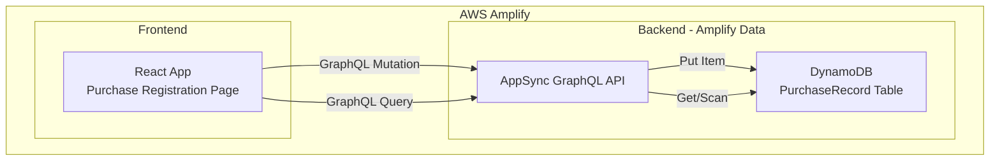
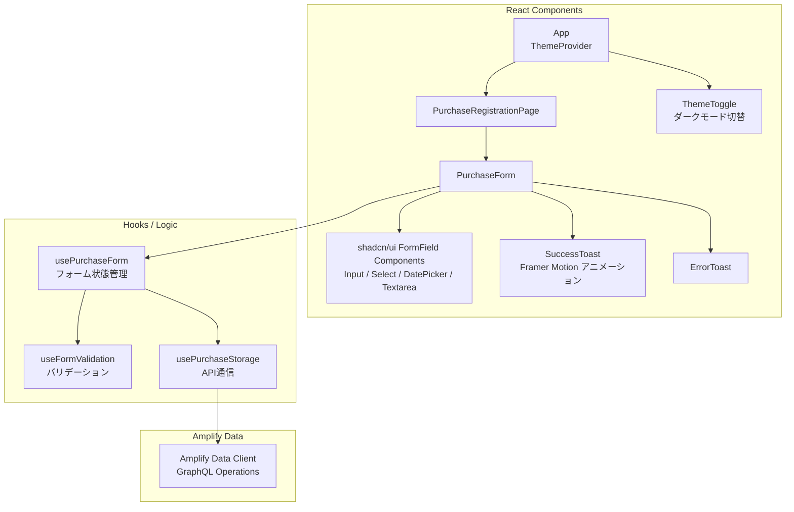

# 技術設計ドキュメント: 購入したお酒の登録

## Overview

本設計は「sakekasu-builder.com」の最初の機能である、購入したお酒の登録ページの技術設計を定義する。ユーザーはWebフォームを通じて購入情報（銘柄名、購入店舗、価格、日付、カテゴリ、メモ）を入力し、AWSバックエンドに保存できる。

### 技術スタック

- **フロントエンド**: React + TypeScript（AWS Amplify Gen 2でホスティング）
- **UIライブラリ**: Tailwind CSS v4 + shadcn/ui + Framer Motion
- **バックエンド**: AWS Amplify Data（AppSync GraphQL API + DynamoDB）
- **インフラ**: AWS Amplify Gen 2（CDKベースのインフラ定義）

### 設計方針

- AWS Amplify Gen 2のData機能を活用し、GraphQL APIとDynamoDBテーブルを自動生成する
- フロントエンドはReact + TypeScriptで構築し、Tailwind CSS + shadcn/uiでモダンなUIを実現する
- 将来の機能追加（一覧表示、飲んだお酒の登録、おすすめ提案）を見据えたデータモデル設計とする
- 1機能ずつ段階的に開発する方針に従い、本設計は購入登録機能のみに焦点を当てる

### UIデザイン方針

お酒の購入登録という体験にふさわしい、洗練されたモダンUIを目指す。

- **デザインテーマ**: 和モダン — 日本酒の落ち着いた雰囲気をベースに、モダンなフラットデザインを融合。ダークモードではバーカウンターのような深みのある色調を採用する
- **カラーパレット**:
  - ライトモード: 白基調 + アクセントに深い藍色（`#1B365D`）と金色（`#C5A572`）
  - ダークモード: ダークグレー基調（`#1A1A2E`）+ アクセントに淡い金色（`#D4AF37`）と柔らかい白
- **タイポグラフィ**: Noto Sans JP（本文）+ Inter（数値・英字）で可読性と洗練さを両立
- **レスポンシブデザイン**: モバイルファーストで設計。スマホでの片手操作を考慮したフォームレイアウト
- **ダークモード**: `next-themes` または Tailwind CSSの `dark:` バリアントを使用し、システム設定に連動 + 手動切替可能
- **アニメーション**: Framer Motionを使用し、フォーム表示時のフェードイン、成功メッセージのスライドイン、ボタンのホバーエフェクトなど、控えめで上品なマイクロインタラクションを実装
- **コンポーネントスタイル**: shadcn/uiのコンポーネントをベースに、角丸（`rounded-xl`）、ソフトシャドウ（`shadow-lg`）、グラスモーフィズム風の半透明カードを活用

## Architecture

### システム構成図



### コンポーネント構成図




## Components and Interfaces

### 1. Amplify Data Schema（`amplify/data/resource.ts`）

Amplify Gen 2のData機能でGraphQL APIとDynamoDBテーブルを定義する。

```typescript
// amplify/data/resource.ts
import { type ClientSchema, a, defineData } from '@aws-amplify/backend';

const schema = a.schema({
  SakeCategory: a.enum(['NIHONSHU', 'BEER', 'WINE', 'WHISKY', 'SHOCHU', 'OTHER']),

  PurchaseRecord: a.model({
    sakeName: a.string().required(),
    storeName: a.string().required(),
    price: a.integer().required(),
    purchaseDate: a.date().required(),
    category: a.ref('SakeCategory').required(),
    memo: a.string(),
  }).authorization(allow => [allow.publicApiKey()]),
});

export type Schema = ClientSchema<typeof schema>;
export const data = defineData({
  schema,
  authorizationModes: {
    defaultAuthorizationMode: 'apiKey',
    apiKeyAuthorizationMode: {
      expiresInDays: 365,
    },
  },
});
```

> **設計判断**: 初期段階では認証なしのAPIキー認証を採用する。将来的にユーザー認証機能を追加する際にCognito認証に切り替える。`id`と`createdAt`/`updatedAt`はAmplify Dataが自動生成するため、スキーマに明示的に定義しない。

### 2. PurchaseForm コンポーネント

フォームの表示とユーザー入力を管理するメインコンポーネント。shadcn/uiのフォームコンポーネントをベースに、Tailwind CSSでスタイリングする。

```typescript
interface PurchaseFormProps {
  onSubmitSuccess: () => void;
}

// フォームの入力値の型
interface PurchaseFormData {
  sakeName: string;
  storeName: string;
  price: string;        // 入力時は文字列、送信時にnumberへ変換
  purchaseDate: string; // YYYY-MM-DD形式
  category: SakeCategory;
  memo: string;
}

// バリデーションエラーの型
interface ValidationErrors {
  sakeName?: string;
  storeName?: string;
  price?: string;
  purchaseDate?: string;
  category?: string;
}
```

**使用するshadcn/uiコンポーネント:**

| フィールド | コンポーネント | 備考 |
|-----------|--------------|------|
| 銘柄名 | `<Input />` | プレースホルダー付き |
| 購入店舗名 | `<Input />` | プレースホルダー付き |
| 購入価格 | `<Input type="number" />` | 円マーク接頭辞付き |
| 購入日 | `<Popover />` + `<Calendar />` | shadcn/uiのDatePicker パターン |
| カテゴリ | `<Select />` | カテゴリアイコン付き |
| メモ | `<Textarea />` | リサイズ可能 |
| 登録ボタン | `<Button />` | 送信中はローディングスピナー表示 |

**UIレイアウト:**

```
┌─────────────────────────────────────────────┐
│  🍶 購入したお酒を登録        [🌙 ダーク切替] │
│                                             │
│  ┌─ Card (グラスモーフィズム) ─────────────┐  │
│  │                                       │  │
│  │  銘柄名     [________________]        │  │
│  │  購入店舗   [________________]        │  │
│  │  購入価格   [¥ _____________ ]        │  │
│  │  購入日     [📅 2025/01/01   ]        │  │
│  │  カテゴリ   [▼ 日本酒        ]        │  │
│  │  メモ       [________________]        │  │
│  │             [________________]        │  │
│  │                                       │  │
│  │         [ 🍶 登録する ]               │  │
│  │                                       │  │
│  └───────────────────────────────────────┘  │
│                                             │
│  ✅ 登録が完了しました（トースト通知）        │
└─────────────────────────────────────────────┘
```

**アニメーション仕様:**

| 要素 | アニメーション | ライブラリ |
|------|--------------|-----------|
| フォームカード | ページ表示時にフェードイン + 下からスライド | Framer Motion |
| 登録ボタン | ホバー時にスケールアップ（1.02倍）+ 色変化 | Tailwind CSS transition |
| 成功メッセージ | 右上からスライドイン → 3秒後にフェードアウト | Framer Motion |
| エラーメッセージ | シェイクアニメーション | Framer Motion |
| フォームリセット | フィールドのフェードアウト → フェードイン | Framer Motion |
| バリデーションエラー | フィールド下にスライドダウンで表示 | Framer Motion AnimatePresence |

### 3. useFormValidation フック

フォーム入力値のバリデーションロジックを提供するカスタムフック。

```typescript
interface UseFormValidationReturn {
  errors: ValidationErrors;
  validateField: (field: keyof PurchaseFormData, value: string) => string | undefined;
  validateAll: (data: PurchaseFormData) => ValidationErrors;
  isValid: (data: PurchaseFormData) => boolean;
  clearErrors: () => void;
}

function useFormValidation(): UseFormValidationReturn;
```

**バリデーションルール:**

| フィールド | ルール |
|-----------|--------|
| sakeName | 空文字・空白のみ不可 |
| storeName | 空文字・空白のみ不可 |
| price | 0以上の整数のみ。数値以外・負の値は不可 |
| purchaseDate | 必須。未来の日付は不可 |
| category | 必須。定義済みカテゴリのいずれか |

### 4. usePurchaseStorage フック

Amplify Data Clientを使用してPurchaseRecordの保存を行うカスタムフック。

```typescript
interface UsePurchaseStorageReturn {
  savePurchase: (data: PurchaseFormData) => Promise<SaveResult>;
  isSaving: boolean;
}

interface SaveResult {
  success: boolean;
  error?: string;
}

function usePurchaseStorage(): UsePurchaseStorageReturn;
```

## Data Models

### PurchaseRecord（DynamoDB テーブル）

Amplify Dataにより自動生成されるDynamoDBテーブル。

| フィールド | 型 | 必須 | 説明 |
|-----------|-----|------|------|
| id | String (UUID) | ✅ | 自動生成される一意のID |
| sakeName | String | ✅ | 銘柄名 |
| storeName | String | ✅ | 購入店舗名 |
| price | Integer | ✅ | 購入価格（0以上） |
| purchaseDate | AWSDate | ✅ | 購入日（YYYY-MM-DD） |
| category | SakeCategory (Enum) | ✅ | お酒のカテゴリ |
| memo | String | ❌ | メモ（空文字許可） |
| createdAt | AWSDateTime | ✅ | 登録日時（自動生成） |
| updatedAt | AWSDateTime | ✅ | 更新日時（自動生成） |

### SakeCategory（列挙型）

| 値 | 表示名 |
|----|--------|
| NIHONSHU | 日本酒 |
| BEER | ビール |
| WINE | ワイン |
| WHISKY | ウイスキー |
| SHOCHU | 焼酎 |
| OTHER | その他 |

### DynamoDB アクセスパターン

| パターン | 操作 | 用途 |
|---------|------|------|
| 購入記録の作成 | CreatePurchaseRecord Mutation | 新規購入情報の登録 |
| 登録日時降順で取得 | ListPurchaseRecords Query (sortDirection: DESC) | 将来の一覧表示機能で使用 |

> **設計判断**: Amplify DataはデフォルトでDynamoDBのPartition Key（id）を使用する。登録日時降順の取得は、将来の一覧表示機能実装時にSecondary Indexを追加して対応する。現段階では購入登録のCreate操作のみを実装する。


## Correctness Properties

*プロパティとは、システムの全ての有効な実行において真であるべき特性や振る舞いのことである。プロパティは人間が読める仕様と機械的に検証可能な正しさの保証をつなぐ橋渡しの役割を果たす。*

### Property 1: 必須フィールド空欄バリデーション

*For any* 必須フィールド（銘柄名、購入店舗名、購入価格、購入日、カテゴリ）のうち、任意の1つ以上が空文字または空白のみである入力データに対して、バリデーションは失敗を返し、該当フィールドにエラーメッセージが設定されるべきである。

**Validates: Requirements 2.1**

### Property 2: 無効な価格入力バリデーション

*For any* 数値以外の文字列、または負の数値が購入価格として入力された場合、バリデーションは失敗を返し、「価格は0以上の数値で入力してください」というエラーメッセージが設定されるべきである。

**Validates: Requirements 2.2, 2.3**

### Property 3: 未来日付バリデーション

*For any* 本日より後の日付が購入日として入力された場合、バリデーションは失敗を返し、「購入日は本日以前の日付を入力してください」というエラーメッセージが設定されるべきである。

**Validates: Requirements 2.4**

### Property 4: 有効入力のバリデーション通過

*For any* 全ての必須フィールドが正しく入力されたデータ（銘柄名・店舗名が非空白文字列、価格が0以上の整数、購入日が本日以前、カテゴリが有効な列挙値）に対して、バリデーションは成功を返すべきである。

**Validates: Requirements 2.5**

### Property 5: 保存成功後のフォームリセット

*For any* 有効な入力データで保存が成功した場合、フォームの全フィールドは初期状態（銘柄名・店舗名・メモは空文字、購入日は当日、価格は空、カテゴリはデフォルト値）にリセットされるべきである。

**Validates: Requirements 3.3, 5.1**

### Property 6: 保存失敗時の入力保持

*For any* 有効な入力データで保存が失敗した場合、フォームの全フィールドは送信前の入力値をそのまま保持すべきである。

**Validates: Requirements 3.5**

### Property 7: PurchaseRecordのラウンドトリップ

*For any* 有効なPurchaseRecord（有効な銘柄名、店舗名、0以上の価格、本日以前の日付、有効なカテゴリ、任意のメモ）に対して、Purchase_Storageに保存した後に取得した結果は、元のPurchaseRecordと同等の内容（銘柄名、店舗名、価格、購入日、カテゴリ、メモ）を持つべきである。

**Validates: Requirements 4.3**

### Property 8: 登録日時降順取得

*For any* 複数のPurchaseRecordの集合に対して、Purchase_Storageから取得した結果は登録日時（createdAt）の降順で並んでいるべきである。

**Validates: Requirements 4.2**

### Property 9: 連続登録時の成功メッセージ表示

*For any* N回（N >= 2）の連続した有効な登録操作に対して、各登録成功後に成功メッセージが表示されるべきである。

**Validates: Requirements 5.2**

## Error Handling

### バリデーションエラー

| エラー条件 | エラーメッセージ | 表示位置 |
|-----------|----------------|---------|
| 必須フィールドが空 | 「{フィールド名}は必須です」 | 該当フィールドの横 |
| 価格が数値以外または負の値 | 「価格は0以上の数値で入力してください」 | 価格フィールドの横 |
| 購入日が未来の日付 | 「購入日は本日以前の日付を入力してください」 | 購入日フィールドの横 |

### API通信エラー

| エラー条件 | ユーザーへの表示 | システム動作 |
|-----------|----------------|-------------|
| ネットワークエラー | 「登録に失敗しました。もう一度お試しください」 | 入力内容を保持、再送信可能 |
| AppSync APIエラー | 「登録に失敗しました。もう一度お試しください」 | 入力内容を保持、再送信可能 |
| DynamoDB書き込みエラー | 「登録に失敗しました。もう一度お試しください」 | 入力内容を保持、再送信可能 |

### エラーハンドリング方針

- バリデーションエラーはフィールド単位でリアルタイムに表示する（onBlur時）。Framer MotionのAnimatePresenceでスムーズに表示・非表示を切り替える
- API通信エラーはshadcn/uiの`<Toast />`コンポーネントで画面右上に表示する
- エラー発生時は入力内容を保持し、ユーザーが修正・再送信できる状態を維持する
- コンソールにはデバッグ用の詳細エラー情報をログ出力する

## Testing Strategy

### テスト方針

本機能では、ユニットテストとプロパティベーステストの2つのアプローチを組み合わせて包括的なテストカバレッジを実現する。

### プロパティベーステスト

**ライブラリ**: [fast-check](https://github.com/dubzzz/fast-check)（TypeScript向けプロパティベーステストライブラリ）

**設定**:
- 各プロパティテストは最低100回のイテレーションを実行する
- 各テストにはデザインドキュメントのプロパティ番号をタグとしてコメントに記載する
- タグ形式: `Feature: sake-purchase-registration, Property {number}: {property_text}`
- 1つのCorrectnessプロパティにつき1つのプロパティベーステストを実装する

**テスト対象プロパティ**:

| プロパティ | テスト内容 | ジェネレータ |
|-----------|-----------|-------------|
| Property 1 | 必須フィールド空欄でバリデーション失敗 | 必須フィールドのランダムな部分集合を空にした入力データ |
| Property 2 | 無効な価格でバリデーション失敗 | 非数値文字列、負の数値のランダム生成 |
| Property 3 | 未来日付でバリデーション失敗 | 明日以降のランダムな日付 |
| Property 4 | 有効入力でバリデーション成功 | 全フィールドが有効なランダム入力データ |
| Property 5 | 保存成功後のフォームリセット | ランダムな有効入力データ + 保存成功モック |
| Property 6 | 保存失敗時の入力保持 | ランダムな有効入力データ + 保存失敗モック |
| Property 7 | PurchaseRecordのラウンドトリップ | ランダムなPurchaseRecordデータ |
| Property 8 | 登録日時降順取得 | ランダムな複数PurchaseRecord |
| Property 9 | 連続登録時の成功メッセージ | ランダムな回数(2〜10)の有効入力データ |

### ユニットテスト

**ライブラリ**: Vitest

**テスト対象**:

- フォーム初期表示（必須フィールドの存在確認、購入日の初期値、カテゴリ選択肢）
- 保存成功時の成功メッセージ表示
- 保存失敗時のエラーメッセージ表示
- PurchaseRecordのデータ構造確認
- 各コンポーネントの基本的なレンダリング確認

### テストファイル構成

```
src/
  features/
    purchase/
      __tests__/
        validation.test.ts          # バリデーションロジックのユニットテスト
        validation.property.test.ts # バリデーションのプロパティテスト
        storage.property.test.ts    # ストレージのプロパティテスト（Property 7, 8）
        PurchaseForm.test.tsx       # フォームコンポーネントのユニットテスト
        PurchaseForm.property.test.tsx # フォームUIのプロパティテスト（Property 5, 6, 9）
```

### UIテストの補足

- shadcn/uiコンポーネントのレンダリング確認はユニットテストで実施する
- ダークモード切替の動作確認はユニットテストで`ThemeToggle`コンポーネントをテストする
- アニメーションの存在確認（Framer Motionのmotion要素が正しくレンダリングされること）はユニットテストで確認する
- レスポンシブレイアウトの確認は手動テストまたはVisual Regression Testで対応する
