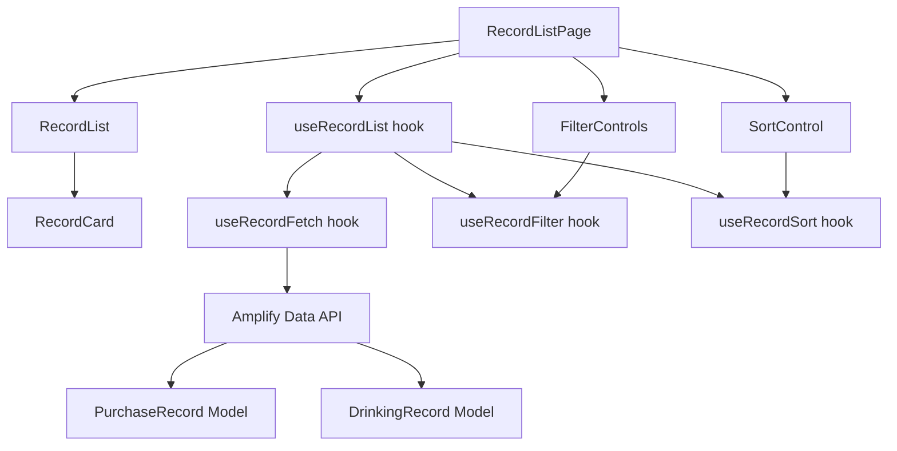

# Design Document: 購入・飲酒記録の一覧ページ

## Overview

購入記録（PurchaseRecord）と飲酒記録（DrinkingRecord）を統合的に一覧表示するページを構築する。ユーザーは記録種別・カテゴリによるフィルタリング、日付・価格による並び替えを行い、過去の記録を効率的に振り返ることができる。

既存の `src/features/purchase/` と `src/features/drinking/` の型定義・Amplify Data API パターンを踏襲し、`src/features/records/` に新機能を配置する。

## Architecture



### ディレクトリ構成

```
src/features/records/
  components/
    RecordListPage.tsx      # ページコンポーネント
    RecordCard.tsx           # 記録カードコンポーネント
    FilterControls.tsx       # フィルタUI（種別 + カテゴリ）
    SortControl.tsx          # 並び替えUI
    EmptyState.tsx           # 空状態メッセージ
    LoadingState.tsx         # ローディング表示
    ErrorState.tsx           # エラー表示 + 再取得ボタン
  hooks/
    useRecordFetch.ts        # Amplify からのデータ取得
    useRecordFilter.ts       # フィルタリングロジック（純粋関数）
    useRecordSort.ts         # ソートロジック（純粋関数）
    useRecordList.ts         # 上記3つを統合するフック
  types.ts                   # 型定義
  __tests__/                 # テスト
```

### 設計方針

- **ロジックとUIの分離**: フィルタリング・ソートは純粋関数として実装し、テスタビリティを確保
- **既存パターンの踏襲**: `generateClient<Schema>()` による Amplify Data API 呼び出しパターンを再利用
- **コンポーネント分割**: 各UIパーツを小さなコンポーネントに分割し、責務を明確化

## Components and Interfaces

### RecordListPage

ページ全体のレイアウトを管理するコンテナコンポーネント。`useRecordList` フックを使用してデータ取得・フィルタ・ソートの状態を管理する。

```tsx
function RecordListPage(): JSX.Element
```

### RecordCard

個々の記録を表示するカードコンポーネント。記録種別に応じて表示内容を切り替える。

```tsx
interface RecordCardProps {
  record: UnifiedRecord;
}
function RecordCard({ record }: RecordCardProps): JSX.Element
```

### FilterControls

記録種別フィルタとカテゴリフィルタを提供するコンポーネント。

```tsx
interface FilterControlsProps {
  recordType: RecordTypeFilter;
  category: CategoryFilter;
  onRecordTypeChange: (type: RecordTypeFilter) => void;
  onCategoryChange: (category: CategoryFilter) => void;
}
function FilterControls(props: FilterControlsProps): JSX.Element
```

### SortControl

並び替えオプションを提供するコンポーネント。

```tsx
interface SortControlProps {
  sortOption: SortOption;
  onSortChange: (option: SortOption) => void;
}
function SortControl(props: SortControlProps): JSX.Element
```

### useRecordFetch

Amplify Data API から PurchaseRecord と DrinkingRecord を取得し、UnifiedRecord に変換する。

```tsx
interface UseRecordFetchReturn {
  records: UnifiedRecord[];
  isLoading: boolean;
  error: string | null;
  refetch: () => void;
}
function useRecordFetch(): UseRecordFetchReturn
```

### useRecordFilter（純粋関数）

フィルタリングロジック。UIフックではなく純粋関数としてエクスポートし、プロパティベーステストを容易にする。

```tsx
function filterRecords(
  records: UnifiedRecord[],
  recordType: RecordTypeFilter,
  category: CategoryFilter
): UnifiedRecord[]
```

### useRecordSort（純粋関数）

ソートロジック。同様に純粋関数としてエクスポートする。

```tsx
function sortRecords(
  records: UnifiedRecord[],
  sortOption: SortOption
): UnifiedRecord[]
```

### useRecordList

上記フックと純粋関数を統合し、ページコンポーネントに必要な全状態を提供する。

```tsx
interface UseRecordListReturn {
  records: UnifiedRecord[];          // フィルタ・ソート適用済み
  isLoading: boolean;
  error: string | null;
  recordType: RecordTypeFilter;
  category: CategoryFilter;
  sortOption: SortOption;
  setRecordType: (type: RecordTypeFilter) => void;
  setCategory: (category: CategoryFilter) => void;
  setSortOption: (option: SortOption) => void;
  refetch: () => void;
}
function useRecordList(): UseRecordListReturn
```


## Data Models

### 型定義（`src/features/records/types.ts`）

```typescript
import type { SakeCategory } from '../purchase/types';

// 記録種別
export type RecordType = 'purchase' | 'drinking';

// 統合記録型: PurchaseRecord と DrinkingRecord を統一的に扱う
export interface UnifiedRecord {
  id: string;
  type: RecordType;
  sakeName: string;
  price: number | null;        // DrinkingRecord は price が optional
  date: string;                // YYYY-MM-DD（purchaseDate or drinkingDate）
  category: SakeCategory;
  memo?: string;
  // 購入記録固有
  storeName?: string;
  // 飲酒記録固有
  placeName?: string;
  drinkingMethod?: string;
  rating?: number;             // 1〜5
  createdAt: string;           // Amplify 自動生成
  updatedAt: string;           // Amplify 自動生成
}

// フィルタ型
export type RecordTypeFilter = 'all' | 'purchase' | 'drinking';
export type CategoryFilter = 'all' | SakeCategory;

// ソートオプション
export type SortOption = 'date-desc' | 'date-asc' | 'price-desc' | 'price-asc';

// ソートオプションのラベルマッピング
export const SORT_OPTIONS: { value: SortOption; label: string }[] = [
  { value: 'date-desc', label: '日付（新しい順）' },
  { value: 'date-asc', label: '日付（古い順）' },
  { value: 'price-desc', label: '価格（高い順）' },
  { value: 'price-asc', label: '価格（低い順）' },
];

// 記録種別フィルタのラベルマッピング
export const RECORD_TYPE_OPTIONS: { value: RecordTypeFilter; label: string }[] = [
  { value: 'all', label: 'すべて' },
  { value: 'purchase', label: '購入記録' },
  { value: 'drinking', label: '飲酒記録' },
];

// カテゴリフィルタのラベルマッピング
export const CATEGORY_FILTER_OPTIONS: { value: CategoryFilter; label: string }[] = [
  { value: 'all', label: 'すべて' },
  { value: 'NIHONSHU', label: '日本酒' },
  { value: 'BEER', label: 'ビール' },
  { value: 'WINE', label: 'ワイン' },
  { value: 'WHISKY', label: 'ウイスキー' },
  { value: 'SHOCHU', label: '焼酎' },
  { value: 'OTHER', label: 'その他' },
];
```

### Amplify → UnifiedRecord 変換

PurchaseRecord と DrinkingRecord はスキーマが異なるため、取得後に `UnifiedRecord` に正規化する。

```typescript
// PurchaseRecord → UnifiedRecord
function toPurchaseUnifiedRecord(record: Schema['PurchaseRecord']['type']): UnifiedRecord {
  return {
    id: record.id,
    type: 'purchase',
    sakeName: record.sakeName,
    price: record.price,
    date: record.purchaseDate,
    category: record.category,
    memo: record.memo ?? undefined,
    storeName: record.storeName,
    createdAt: record.createdAt,
    updatedAt: record.updatedAt,
  };
}

// DrinkingRecord → UnifiedRecord
function toDrinkingUnifiedRecord(record: Schema['DrinkingRecord']['type']): UnifiedRecord {
  return {
    id: record.id,
    type: 'drinking',
    sakeName: record.sakeName,
    price: record.price ?? null,
    date: record.drinkingDate,
    category: record.category,
    memo: record.memo ?? undefined,
    placeName: record.placeName,
    drinkingMethod: record.drinkingMethod,
    rating: record.rating,
    createdAt: record.createdAt,
    updatedAt: record.updatedAt,
  };
}
```


## Correctness Properties

*プロパティとは、システムの全ての有効な実行において成り立つべき特性や振る舞いのことです。人間が読める仕様と機械的に検証可能な正しさの保証をつなぐ橋渡しの役割を果たします。*

### Property 1: 記録種別フィルタの正確性

*For any* UnifiedRecord のリストと *for any* RecordTypeFilter の値に対して、`filterRecords` を適用した結果は以下を満たす:
- `'all'` の場合: 結果の長さが元のリストと等しい
- `'purchase'` の場合: 結果のすべての要素が `type === 'purchase'`
- `'drinking'` の場合: 結果のすべての要素が `type === 'drinking'`

**Validates: Requirements 2.2, 2.3, 2.4**

### Property 2: カテゴリフィルタの正確性

*For any* UnifiedRecord のリストと *for any* CategoryFilter の値に対して、`filterRecords` を適用した結果は以下を満たす:
- `'all'` の場合: 結果の長さが元のリストと等しい
- 特定カテゴリの場合: 結果のすべての要素が指定カテゴリと一致する

**Validates: Requirements 3.2, 3.3**

### Property 3: フィルタの合成（AND条件）

*For any* UnifiedRecord のリストと *for any* RecordTypeFilter と *for any* CategoryFilter の組み合わせに対して、`filterRecords(records, recordType, category)` の結果は、`filterRecords(filterRecords(records, recordType, 'all'), 'all', category)` の結果と等しい（フィルタの適用順序に依存しない）。

**Validates: Requirements 3.4**

### Property 4: 日付ソートの整列性

*For any* UnifiedRecord のリストと *for any* 日付ソートオプション（`'date-desc'` または `'date-asc'`）に対して、`sortRecords` を適用した結果の隣接する全ペア `(records[i], records[i+1])` について:
- `'date-desc'` の場合: `records[i].date >= records[i+1].date`
- `'date-asc'` の場合: `records[i].date <= records[i+1].date`

**Validates: Requirements 4.2, 4.3**

### Property 5: 価格ソートの整列性（null末尾保証）

*For any* UnifiedRecord のリスト（price が null の要素を含む）と *for any* 価格ソートオプション（`'price-desc'` または `'price-asc'`）に対して、`sortRecords` を適用した結果は以下を満たす:
- price が null の要素はすべて末尾に配置される
- price が非null の隣接ペアについて、`'price-desc'` なら降順、`'price-asc'` なら昇順

**Validates: Requirements 4.4, 4.5**

### Property 6: フィルタはレコードを追加しない（メタモルフィック）

*For any* UnifiedRecord のリストと *for any* フィルタ条件の組み合わせに対して、`filterRecords` の結果の長さは元のリストの長さ以下であり、結果のすべての要素は元のリストに含まれる。

**Validates: Requirements 2.2, 2.3, 2.4, 3.2, 3.3**

### Property 7: ソートは要素を保存する（不変量）

*For any* UnifiedRecord のリストと *for any* SortOption に対して、`sortRecords` の結果は元のリストと同じ要素を同じ数だけ含む（要素の集合が変わらない）。

**Validates: Requirements 4.2, 4.3, 4.4, 4.5**

### Property 8: RecordCard の必須フィールド表示

*For any* UnifiedRecord に対して、RecordCard のレンダリング結果は以下を含む:
- 共通: 銘柄名、カテゴリ、記録種別ラベル
- `type === 'purchase'` の場合: 購入店舗、価格、購入日
- `type === 'drinking'` の場合: 飲んだ場所、飲んだ日、飲み方、評価

**Validates: Requirements 1.2, 1.3, 1.4**

## Error Handling

### データ取得エラー

| エラー種別 | 対応 |
|-----------|------|
| ネットワークエラー | エラーメッセージ「データの取得に失敗しました」+ 再取得ボタンを表示 |
| Amplify API エラー | 同上。コンソールにエラー詳細をログ出力 |
| 部分的エラー（片方のみ失敗） | 取得できたデータのみ表示し、エラーメッセージで通知 |

### 空状態

| 状態 | 表示メッセージ |
|------|--------------|
| 記録が0件（フィルタなし） | 「記録がありません」 |
| フィルタ結果が0件 | 「条件に一致する記録がありません」 |

### ローディング

- データ取得中はスケルトンUIまたはスピナーを表示
- フィルタ・ソートの切り替えはクライアントサイドで即時反映（追加のローディング不要）

## Testing Strategy

### テストライブラリ

- **ユニットテスト**: Vitest + Testing Library
- **プロパティベーステスト**: fast-check（既存プロジェクトで使用中）
- **テスト配置**: `src/features/records/__tests__/`

### プロパティベーステスト

各プロパティテストは最低100イテレーション実行する。各テストにはデザインドキュメントのプロパティ番号をタグとしてコメントに記載する。

タグ形式: `Feature: sake-record-list, Property {number}: {property_text}`

各 Correctness Property は1つのプロパティベーステストで実装する。

| テストファイル | 対象プロパティ | 内容 |
|--------------|--------------|------|
| `filter.property.test.ts` | Property 1, 2, 3, 6 | filterRecords 純粋関数のプロパティテスト |
| `sort.property.test.ts` | Property 4, 5, 7 | sortRecords 純粋関数のプロパティテスト |
| `RecordCard.property.test.tsx` | Property 8 | RecordCard レンダリングのプロパティテスト |

### ユニットテスト

ユニットテストはプロパティテストを補完し、具体的な例・エッジケース・UI状態に焦点を当てる。

| テストファイル | 内容 |
|--------------|------|
| `RecordListPage.test.tsx` | 空状態メッセージ、ローディング表示、エラー表示+再取得ボタン |
| `FilterControls.test.tsx` | フィルタ選択肢の存在確認、初期状態の確認 |
| `SortControl.test.tsx` | ソートオプションの存在確認、初期状態の確認 |
| `RecordCard.test.tsx` | 購入/飲酒記録の具体的な表示例 |

### テストデータ生成（fast-check Arbitrary）

```typescript
import * as fc from 'fast-check';
import type { UnifiedRecord, RecordTypeFilter, CategoryFilter, SortOption } from '../types';
import { SAKE_CATEGORIES } from '../../purchase/types';

// UnifiedRecord の Arbitrary
const arbRecordType = fc.constantFrom('purchase' as const, 'drinking' as const);
const arbCategory = fc.constantFrom(...SAKE_CATEGORIES);
const arbDate = fc.date({ min: new Date('2020-01-01'), max: new Date('2030-12-31') })
  .map(d => d.toISOString().split('T')[0]);
const arbPrice = fc.option(fc.integer({ min: 0, max: 100000 }), { nil: null });

const arbUnifiedRecord: fc.Arbitrary<UnifiedRecord> = fc.record({
  id: fc.uuid(),
  type: arbRecordType,
  sakeName: fc.string({ minLength: 1, maxLength: 50 }),
  price: arbPrice,
  date: arbDate,
  category: arbCategory,
  memo: fc.option(fc.string({ maxLength: 200 }), { nil: undefined }),
  storeName: fc.option(fc.string({ minLength: 1, maxLength: 50 }), { nil: undefined }),
  placeName: fc.option(fc.string({ minLength: 1, maxLength: 50 }), { nil: undefined }),
  drinkingMethod: fc.option(fc.string({ minLength: 1, maxLength: 20 }), { nil: undefined }),
  rating: fc.option(fc.integer({ min: 1, max: 5 }), { nil: undefined }),
  createdAt: fc.constant(new Date().toISOString()),
  updatedAt: fc.constant(new Date().toISOString()),
});

// フィルタ・ソートオプションの Arbitrary
const arbRecordTypeFilter = fc.constantFrom<RecordTypeFilter>('all', 'purchase', 'drinking');
const arbCategoryFilter = fc.constantFrom<CategoryFilter>('all', ...SAKE_CATEGORIES);
const arbSortOption = fc.constantFrom<SortOption>('date-desc', 'date-asc', 'price-desc', 'price-asc');
```
